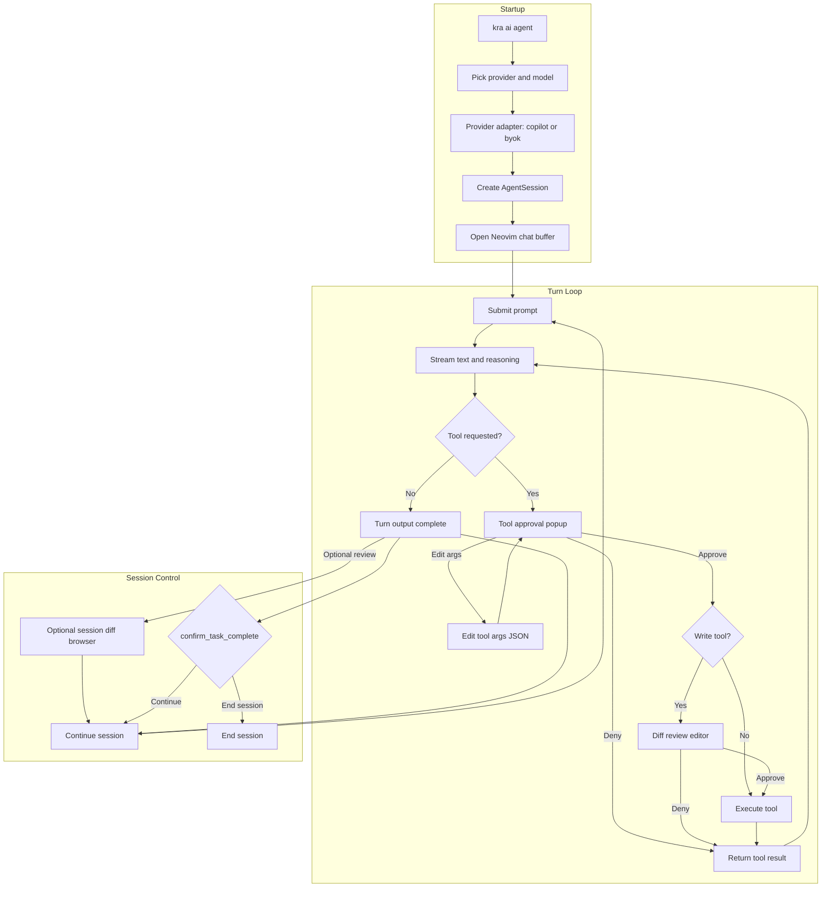

# 🤖 Agent Mode

A full agentic workflow integrated directly into Neovim. The agent reasons, calls tools, edits files, runs shell commands, and queries MCP servers. Changes land as **uncommitted git diffs** that you inspect in Neovim before deciding to keep or discard them.

Two provider backends are supported behind a single command — `kra ai agent`:

| Provider | Backend | Auth | Built-in tools | Extra MCP servers added by Kra |
|----------|---------|------|----------------|-------------------------------|
| **copilot** | `@github/copilot-sdk` | GitHub Copilot subscription (logged-in user or `GITHUB_TOKEN`) | yes (SDK ships its own bash/web tools) | `kra-file-context`, `session-complete` |
| **byok** | OpenAI-compatible Chat Completions (`openai` package) | Your own API key per provider | no — provided via Kra MCP servers | `kra-file-context`, `session-complete`, **`kra-memory`**, **`kra-bash`**, **`kra-web`** |

When you run `kra ai agent`, the first picker is **provider selection** (`copilot` / `byok`). Everything downstream — Neovim chat buffer, tool-approval popups, diff editor, session diff history, file-context tools — is shared by both providers.

## 📋 Table of Contents

- [Quick Start](#-quick-start)
- [How It Works](#-how-it-works)
- [Architecture](#-architecture)
- [Detailed Documentation](#-detailed-documentation)

---

## 🚀 Quick Start

```bash
kra ai agent
```

1. Pick a provider (`copilot` or `byok`)
2. **byok only:** pick a sub-provider (`open-ai`, `deep-seek`, `gemini`, `open-router`, `deep-infra`, `mistral`)
3. Pick a model from the live catalog (annotated with context window + per-token pricing for BYOK, or billing multiplier for Copilot)
4. **Copilot only:** if the model exposes multiple reasoning efforts, pick one
5. Neovim chat buffer opens — type your prompt below the draft header and press **Enter** in normal mode to submit

---

## 🏗 How It Works

### The Repository Is the Workspace

The agent works directly inside your repository, writing changes as **uncommitted git diffs**. Nothing is staged or committed automatically — every change is visible via `git status` and `git diff` at any time.

```
Your repository
───────────────
src/            ← agent edits files here (uncommitted)
package.json    ← changes visible as git diff
```

Use `<leader>d` to open the proposal diff tab at any time to review what changed.

- **Apply** (`<leader>a`) — changes are already on disk; this just confirms you're happy with them.
- **Reject** (`<leader>r`) — runs `git restore . && git clean -fd` to discard all uncommitted changes.

### Session Lifecycle

1. **Start** — `kra ai agent` picks the provider, authenticates / picks a model, then opens Neovim
2. **Turn** — You submit a prompt; the agent reasons and calls tools (with your approval in strict mode)
3. **Review** — Use `<leader>d` to open the proposal diff tab. Inspect, edit files, then apply or reject
4. **Apply** — `<leader>a` (or `a` in the diff tab) acknowledges the changes (already written to disk)
5. **Continue** — Submit the next prompt; changes accumulate as uncommitted diffs across turns
6. **End session** — When the agent calls `confirm_task_complete` and you select "End session", the session closes

### Confirm-Before-Done Protocol

The agent is instructed to always call `confirm_task_complete` before ending a turn. This presents a popup in Neovim with a summary and 2–4 choices. Selecting a choice sends your reply back to the agent. Only "End session" terminates the turn.

### Agent History (per-session)

Every file mutation the agent performs — through `edit`, `create_file`, or even via `bash` (detected via a before/after `git status` snapshot) — is recorded in an in-memory `AgentHistory`. This drives:

- The **session diff history** picker (`<leader>s`) — every write, plus an `ORIG` entry per file
- **Per-file revert** — the picker lets you restore any single file to its pre-session baseline, even after dozens of edits
- **Pending-then-finalize** semantics — the diff editor queues an entry on approve and only commits it once the underlying tool call actually succeeds, so denied or failed edits never pollute history

---

## 🗺 Architecture

The diagram below is the simplified runtime flow (accurate to the current approval and review behavior).



---

## 📚 Detailed Documentation

`AGENT.md` is now the high-level overview. The implementation-heavy sections were split into focused docs so each topic stays easier to navigate and maintain.

| Topic | Doc |
|---|---|
| Documentation index | [`docs/agent/README.md`](docs/agent/README.md) |
| Providers, model catalog, backend add/remove lifecycle | [`docs/agent/providers.md`](docs/agent/providers.md) |
| Turn workflow, keymaps, tool-approval UX, diff review | [`docs/agent/workflow-and-keymaps.md`](docs/agent/workflow-and-keymaps.md) |
| File-context tools, BYOK bash/web tools, MCP config, sub-agents (`investigate`) | [`docs/agent/tools-and-mcp.md`](docs/agent/tools-and-mcp.md) |
| Persistent memory, memory tools, indexing behavior | [`docs/agent/memory-and-indexing.md`](docs/agent/memory-and-indexing.md) |
| Documentation crawling (`kra memory`) | [`docs/agent/docs-crawling.md`](docs/agent/docs-crawling.md) |

If you want to start coding quickly, open `docs/agent/README.md` first, then jump to the topical doc for the subsystem you are touching.
