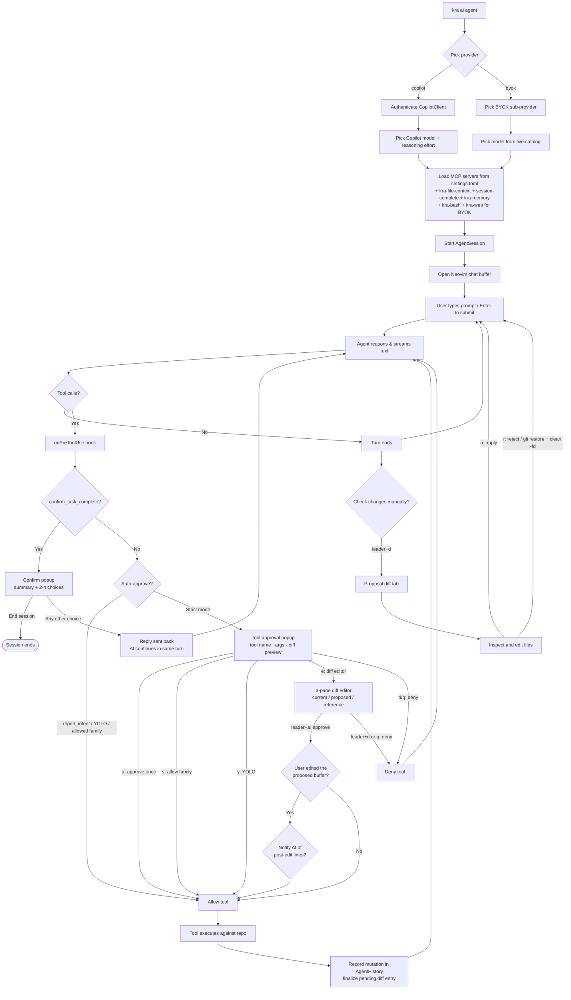

# 🤖 Agent Mode

A full agentic workflow integrated directly into Neovim. The agent reasons, calls tools, edits files, runs shell commands, and queries MCP servers. Changes land as **uncommitted git diffs** that you inspect in Neovim before deciding to keep or discard them.

Two provider backends are supported behind a single command — `kra ai agent`:

| Provider | Backend | Auth | Built-in tools | Extra MCP servers added by Kra |
|----------|---------|------|----------------|-------------------------------|
| **copilot** | `@github/copilot-sdk` | GitHub Copilot subscription (logged-in user or `GITHUB_TOKEN`) | yes (SDK ships its own bash/web tools) | `kra-file-context`, `session-complete` |
| **byok** | OpenAI-compatible Chat Completions (`openai` package) | Your own API key per provider | no — provided via Kra MCP servers | `kra-file-context`, `session-complete`, **`kra-memory`**, **`kra-bash`**, **`kra-web`** |

When you run `kra ai agent`, the first picker is **provider selection** (`copilot` / `byok`). Everything downstream — Neovim chat buffer, tool-approval popups, diff editor, session diff history, file-context tools — is shared by both providers.

## 📋 Table of Contents

- [Quick Start](#-quick-start)
- [How It Works](#-how-it-works)
- [Architecture](#-architecture)
- [Provider: Copilot](#-provider-copilot)
- [Provider: BYOK](#-provider-byok)
- [Model Catalog](#-model-catalog)
- [Key Bindings](#️-key-bindings)
- [Tool Approval](#-tool-approval)
- [Diff Editor & User Edits](#-diff-editor--user-edits)
- [File Editing Tools (kra-file-context MCP)](#-file-editing-tools-kra-file-context-mcp)
- [Bash & Web Tools (BYOK)](#-bash--web-tools-byok)
- [Persistent Memory (kra-memory MCP)](#-persistent-memory-kra-memory-mcp)
- [Session Diff History & Per-File Revert](#-session-diff-history--per-file-revert)
- [Skills (Copilot only)](#-skills-copilot-only)
- [MCP Server Configuration](#-mcp-server-configuration)
- [Quota Monitoring (Copilot only)](#-quota-monitoring-copilot-only)

---

## 🚀 Quick Start

```bash
kra ai agent
```

1. Pick a provider (`copilot` or `byok`)
2. **byok only:** pick a sub-provider (`open-ai`, `deep-seek`, `gemini`, `open-router`, `deep-infra`, `mistral`)
3. Pick a model from the live catalog (annotated with context window + per-token pricing for BYOK, or billing multiplier for Copilot)
4. **Copilot only:** if the model exposes multiple reasoning efforts, pick one
5. Neovim chat buffer opens — type your prompt below the draft header and press **Enter** in normal mode to submit

---

## 🏗 How It Works

### The Repository Is the Workspace

The agent works directly inside your repository, writing changes as **uncommitted git diffs**. Nothing is staged or committed automatically — every change is visible via `git status` and `git diff` at any time.

```
Your repository
───────────────
src/            ← agent edits files here (uncommitted)
package.json    ← changes visible as git diff
```

Use `<leader>d` to open the proposal diff tab at any time to review what changed.

- **Apply** (`<leader>a`) — changes are already on disk; this just confirms you're happy with them.
- **Reject** (`<leader>r`) — runs `git restore . && git clean -fd` to discard all uncommitted changes.

### Session Lifecycle

1. **Start** — `kra ai agent` picks the provider, authenticates / picks a model, then opens Neovim
2. **Turn** — You submit a prompt; the agent reasons and calls tools (with your approval in strict mode)
3. **Review** — Use `<leader>d` to open the proposal diff tab. Inspect, edit files, then apply or reject
4. **Apply** — `<leader>a` (or `a` in the diff tab) acknowledges the changes (already written to disk)
5. **Continue** — Submit the next prompt; changes accumulate as uncommitted diffs across turns
6. **End session** — When the agent calls `confirm_task_complete` and you select "End session", the session closes

### Confirm-Before-Done Protocol

The agent is instructed to always call `confirm_task_complete` before ending a turn. This presents a popup in Neovim with a summary and 2–4 choices. Selecting a choice sends your reply back to the agent. Only "End session" terminates the turn.

### Agent History (per-session)

Every file mutation the agent performs — through `edit_lines`, `create_file`, or even via `bash` (detected via a before/after `git status` snapshot) — is recorded in an in-memory `AgentHistory`. This drives:

- The **session diff history** picker (`<leader>s`) — every write, plus an `ORIG` entry per file
- **Per-file revert** — the picker lets you restore any single file to its pre-session baseline, even after dozens of edits
- **Pending-then-finalize** semantics — the diff editor queues an entry on approve and only commits it once the underlying tool call actually succeeds, so denied or failed edits never pollute history

---

## 🗺 Architecture

The diagram below shows the full turn lifecycle for both providers — the only branching is at session start.



---

## 🟦 Provider: Copilot

Wraps `@github/copilot-sdk` behind the provider-neutral `AgentClient` interface.

- **Auth:** uses your logged-in GitHub Copilot session (via the SDK's device flow), or honours `GITHUB_TOKEN` / `getGithubToken()` from `settings.toml` if set.
- **Models:** fetched live from the Copilot SDK at session start. Each entry is annotated with:
  - `[DISABLED]` — the model is currently unavailable for your account
  - `[xN]` — the billing multiplier (premium-interaction cost) when greater than 1
- **Reasoning effort:** if the chosen model advertises multiple efforts (`low`, `medium`, `high`, `xhigh`), a second picker appears. The model's recommended effort is marked `(default)`.
- **Default model:** set in `settings.toml` to skip the picker:
  ```toml
  [ai.agent]
  defaultModel = "gpt-5-mini"
  ```
- **Built-in tools:** the SDK ships its own bash/web/MCP tooling. Kra **excludes** the SDK's stock file editors (`str_replace_editor`, `write_file`, `read_file`, `edit`, `view`, `grep`, `glob`) so the agent is forced through the precise `kra-file-context` line-range tools described below.
- **Skills:** loaded from `<repo>/skills/` via the SDK's `skillDirectories` option (Copilot only — BYOK has no skill concept).
- **Quota monitoring:** see [Quota Monitoring](#-quota-monitoring-copilot-only).

---

## 🟨 Provider: BYOK

A "Bring Your Own Key" provider that talks to **any OpenAI Chat Completions–compatible API**. Supported sub-providers ship out of the box:

| Sub-provider | Base URL | API key source |
|--------------|----------|----------------|
| `open-ai` | `https://api.openai.com/v1` | `OPENAI_API_KEY` env var |
| `deep-seek` | `https://api.deepseek.com/v1` | `keys.getDeepSeekKey()` |
| `deep-infra` | `https://api.deepinfra.com/v1/openai` | `keys.getDeepInfraKey()` |
| `open-router` | `https://openrouter.ai/api/v1` | `keys.getOpenRouterKey()` |
| `gemini` | `https://generativelanguage.googleapis.com/v1beta/openai/` | `keys.getGeminiKey()` |
| `mistral` | `https://api.mistral.ai/v1` | `keys.getMistralKey()` |


Adding a new BYOK provider is a 3-step change in `src/AI/shared/data/`:

1. Append it to `SUPPORTED_PROVIDERS` in `providers.ts`
2. Add a `baseURL` + key-getter case in `providers.ts`
3. Add a live-fetcher branch in `modelCatalog.ts` (used to populate the model picker)

### How a BYOK turn works

- One session = one OpenAI client + one MCP client pool.
- The session drives a streaming tool-call loop: the model produces text + tool calls, Kra dispatches each tool call through the same `onPreToolUse` / `onPostToolUse` hooks the Copilot path uses, and feeds tool results back as `tool` messages until the model returns a turn with no tool calls.
- Reasoning deltas (`deepseek-reasoner` et al.) are detected via `delta.reasoning_content` / `delta.reasoning` and streamed to the same Neovim reasoning panel the Copilot provider uses.
- Tool denials are surfaced to the model as the tool result so it can react.
- A synthetic **turn reminder** (`onUserPromptSubmitted`) is injected into the system prompt so the model gets the same housekeeping context the Copilot SDK supplies natively.

### Context-window compaction

BYOK ships a **summarization-based compactor** (`byokCompactor.ts`) that triggers when:

- the provider returns a context-length error (matched against common phrasings: `context length`, `maximum context`, `too many tokens`, `reduce the length`, …), **or**
- the estimated token count (chars / 4 heuristic) exceeds the model's advertised context window by the % we set.

When triggered, the compactor:

1. Keeps all `system` messages and the **last 10** non-system messages verbatim
2. Asks the same model to summarize the older transcript into a dense bullet recap (user goals, key decisions, files touched, errors hit, outstanding TODOs)
3. Replaces the older messages with `<compacted_history>…</compacted_history>` and retries the failed request

### MCP client pool

Because BYOK has no SDK-level tools, Kra spins up the configured MCP servers itself via `@modelcontextprotocol/sdk`. Each tool is exposed to the model with a namespaced name (`<server>__<tool>`) to avoid collisions. The pool honours per-server `tools = [...]` allow-lists and the session-level `excludedTools` filter; remote (`http`/`sse`) MCP servers are ignored — BYOK only deals with local stdio servers.

---

## 📚 Model Catalog

Both the BYOK agent picker **and** the regular `kra ai chat` provider picker are now driven by a shared **live model catalog** (`src/AI/shared/data/modelCatalog.ts`).

- Models are fetched directly from each provider's `/models` endpoint at session start
- For providers whose endpoint omits metadata, a small static fallback table fills in well-known context windows + pricing
- Results are cached on disk under `~/.config/kra-tmux/model-catalog/<provider>.json` with a **24-hour TTL**
- On network failure, the **most recent cached snapshot is returned** (even if expired); only if no cache exists does the catalog fall through to the built-in static lists
- The picker formats each entry as `<model id padded>  <Nk ctx>  $<in>/$<out> in/out  cached $<cached>` so you can compare cost and context at a glance
- The catalog's `contextWindow` is the same value that drives BYOK's proactive compaction

---

## ⌨️ Key Bindings

All key bindings below apply to **both** providers unless noted otherwise.

### Chat Buffer

| Key | Action |
|-----|--------|
| `Enter` | Submit prompt |
| `Ctrl+C` | Stop current agent turn |
| `@` | Add file context (Telescope picker) |
| `r` | Remove a file from context |
| `f` | Show active file contexts popup |
| `Ctrl+X` | Clear all file contexts |
| `<leader>o` | Open a changed proposal file |
| `<leader>a` | Apply proposal to the repository |
| `<leader>r` | Reject / discard proposal changes |
| `<leader>y` | Toggle YOLO mode (auto-approve all tools) |
| `<leader>P` | Reset remembered per-family tool approvals |
| `<leader>h` | Browse tool call history for this session |
| `<leader>s` | Browse session diff history (all AI write diffs + per-file `ORIG`) |
| `<leader>m` | Browse `kra-memory`. Picker keys: `<Tab>` cycles all/findings/revisits, `a` adds, `dd`/`D` deletes, `<CR>` opens entry in a scratch buffer. In the buffer: `<leader>w` (or `:w`) saves edits, `<leader>d` deletes, `<leader>r` resolves a revisit, `<leader>x` dismisses a revisit, `q` closes |
| `<Space>t` | Toggle tool/intent popups on or off (global keymap) |
| `<leader>?` | Show all keymaps (which-key) |

> **Note:** `<leader>d` opens the proposal diff tab on demand. `<leader>o/a/r` let you open a file, apply, or reject from anywhere.

#### Tool Call History (`<leader>h`)

Opens a searchable Telescope picker listing every tool invoked during the session — name, started/updated time, and success/failure status. The preview pane shows the tool's **result** (output) for the highlighted entry. Press `<CR>` to open a read-only side-by-side view in a new tab: the **arguments JSON** (as the agent sent them) on the left, and the **tool result** on the right. Inside the view, `q` closes the tab and `<Tab>` / `<S-Tab>` switch focus between the two panes. The history is view-only — tools cannot be re-run from here.

### Proposal Review Tab

The diff tab has its own local keymaps:

| Key | Action |
|-----|--------|
| `a` | Apply proposal to repository |
| `r` | Reject proposal |
| `o` | Open a changed file (Telescope picker) |
| `R` | Refresh the diff |
| `q` | Close the tab |


### Tool Approval Popup

When the agent requests permission to run a tool (strict mode):

| Key | Action |
|-----|--------|
| `<CR>` | Run the currently highlighted action (same as pressing its letter) |
| `<Up>` / `<Down>` | Move the highlight between actions |
| `a` | Approve this tool call once |
| `s` | Allow this **tool family** for the rest of the session |
| `y` | Enable **YOLO mode** — approve everything automatically |
| `e` | Open the **diff editor** to review/edit the proposed change (file writes only — falls back to JSON editor for other tools) |
| `J` / `<leader>j` | Open the raw tool JSON args in an editor (only when a write preview is shown) |
| `d` / `q` | Deny this tool call |

---

## 🔐 Tool Approval

### Auto-Approved Tools

Some tools are always allowed silently, without showing a popup:

| Tool | Reason |
|------|--------|
| `report_intent` | Status-reporting only — no side effects |
| `confirm_task_complete` | Handled by the confirm-before-done popup, not the approval flow |

### Strict Mode (default)

Every other tool call shows a popup. You see the tool name, arguments, and — for file writes — a diff preview. Choose to:

- **Approve once** (`a`) — allow just this call
- **Allow family** (`s`) — remember approval for all tools of the same type (e.g., all shell commands) for this session
- **YOLO mode** (`y`) — disable approval prompts entirely until you reset (`<leader>P`)

### YOLO Mode

All tool calls are approved automatically. File writes still go directly to the repository. Toggle with `<leader>y`; reset with `<leader>P`.

---

## ✏️ Diff Editor & User Edits

From the tool-approval popup, press `e` on a file write (`edit_lines`, `create_file`, …) to open a three-pane diff view: **current** ← **proposed** → **reference** (the original pre-mutation buffer).

| Key | Action |
|-----|--------|
| `<leader>a` | Approve the (possibly edited) proposed content |
| `<leader>d` | Deny |
| `<leader>j` | Edit the raw tool JSON arguments |
| `q` | Close and deny |

### What happens when you edit the proposed buffer

If you change the **proposed** pane before approving, Kra:

1. Computes a prefix/suffix-stripped hunk diff between the original file and your edited proposal
2. Splits the diff into ≤100-line chunks if needed
3. **Replaces the agent's `modifiedArgs`** with a real `edit_lines` call that applies your edit — so the tool runs for real instead of being silently swallowed
4. Asks (`vim.ui.select`) whether the AI should be **notified** of the post-edit lines
   - **Yes, send numbered post-edit lines** — the model sees exactly what landed
   - **No, send a short "trust LSP" notice** — the model is told the user edited it and should re-read if needed
   - The choice is forwarded through `__userEditNotify` and surfaces as `additionalContext` in the next tool result

Denied or intercepted edits are dropped from the session diff history queue; only successful tool executions get committed.

---

## 🛠 File Editing Tools (kra-file-context MCP)

The agent has a built-in MCP server (`kra-file-context`) that exposes precise, line-range based file editing tools. To force the agent to use these — instead of fuzzy string-replacement tools — the SDK's stock editing tools are **excluded** (Copilot provider):

```
excludedTools: ['str_replace_editor', 'write_file', 'read_file', 'edit', 'view', 'grep', 'glob']
```

The built-in `grep` and `glob` tools are also replaced by the unified `search` tool below.

The agent must use the following tools instead:

| Tool | Purpose |
|------|---------|
| `search(name_pattern?, content_pattern?)` | **Unified file finder + content grep.** Provide a glob (`name_pattern`), a regex (`content_pattern`), or both to intersect. Every result is annotated with the file's line count. Powered by ripgrep; respects `.gitignore`. Replaces the built-in `grep`/`glob` tools. |
| `get_outline(file_path)` | Returns a structured outline (functions, classes, methods + line numbers). Cheap way to understand a large file before reading it. |
| `read_lines(file_path, start_line, end_line)` | Read a specific line range (1-indexed, inclusive). |
| `read_lines(file_path, startLines[], endLines[])` | **Array form** — read multiple ranges in one call (parallel arrays). |
| `read_function(file_path, function_name)` | Look up a symbol by name and return its full body. |
| `edit_lines(file_path, start_line, end_line, new_content)` | Replace a line range with new content. Empty `new_content` deletes the lines. Returns the old content for verification. |
| `edit_lines(file_path, startLines[], endLines[], newContents[])` | **Array form** — apply multiple edits in one call. Line numbers refer to the original file; the tool sorts ranges bottom-to-top internally and rejects overlapping ranges. |
| `create_file(file_path, content)` | Create a new file (or overwrite an existing one). Parent directories are created automatically. |
| `lsp_query` | Hover / definition / references / implementations / type-definition / document-symbols against a configured language server (see `[lsp.*]` blocks in `settings.toml`). |

### `search` options

| Option | Type | Description |
|--------|------|-------------|
| `name_pattern` | string | Glob to filter by file name/path (e.g. `**/*.ts`, `src/AI/**/auth*`). |
| `content_pattern` | string | Ripgrep regex to search file contents. |
| `path` | string | Root directory to search from. Defaults to cwd. |
| `type` | string | Ripgrep `--type` alias (e.g. `ts`, `py`, `go`). |
| `case_insensitive` | boolean | Case-insensitive content match. Default `false`. |
| `context` | number | Lines of context around each match (`-C N`). Default `0`. |
| `multiline` | boolean | Allow pattern to match across line boundaries. Default `false`. |
| `max_results` | number | Cap on results (file count or match-line count). Default `50`, hard cap `200`. |

At least one of `name_pattern` or `content_pattern` is required.

### `read_lines` gating

- `read_lines` accepts up to **500 lines per call** (hard cap).
- A **soft gate** bounces a single call back to `get_outline` when the total requested range exceeds **200 lines** — but **only** for files that have a meaningful outline (LSP entries, regex fallback, or import lines). Plain text / CSV / log / markdown-without-headings files are exempt and can be read in any range up to the 500-line cap.

### Recommended workflow

1. `search` → locate the file(s) and note the reported line count
2. `get_outline` → understand the file structure; especially valuable for files over ~150 lines where guessing read ranges wastes tokens
3. `read_lines` → reads only the exact range(s) needed
4. `edit_lines` → replaces them — makes one targeted call per changed section, not a wholesale file rewrite

For multi-section reads/edits, **always prefer the array form** over multiple sequential calls.

---

## 🐚 Bash & Web Tools (BYOK)

Because BYOK has no SDK-level tools, Kra ships two extra MCP servers that are auto-injected only on the BYOK code path:

### `kra-bash` — `bash` tool

- Runs the given shell command via `/bin/sh -c` in `process.env.WORKING_DIR` (set to the agent's CWD)
- Default 120 s timeout, 10 MB combined stdout/stderr cap
- **Output truncation:** anything longer than ~8000 chars is collapsed to **first 2000 + last 6000 chars** with the middle elided — bounds context-window growth without losing tail/head signal
- Emits before/after `git status` snapshots so any files the bash command touches get recorded in `AgentHistory`

### `kra-web` — `web_fetch` + `web_search` tools

| Tool | Purpose | Limits |
|------|---------|--------|
| `web_fetch(url, max_length?)` | Fetches a URL over HTTPS/HTTP, strips HTML to plain text via `cheerio` + `html-to-text` | default 8 000 chars, hard cap 50 000, 20 s timeout |
| `web_search(query, max_results?)` | Scrapes DuckDuckGo's HTML endpoint and returns a markdown list of hits | default 5 results, hard cap 15 |

A realistic browser User-Agent is sent on every request to reduce DuckDuckGo rate-limiting.

> The Copilot provider does **not** load `kra-bash` / `kra-web` — the SDK already provides equivalents.

---

## 🧠 Persistent Memory (kra-memory MCP)

The agent loses context every time a session ends, and even within a session BYOK's compactor and Copilot's SDK compaction smooth specifics away. `kra-memory` gives the agent a **local, persistent vector store** so design decisions, bug fixes, gotchas, and follow-ups survive across sessions, branches, and compaction events.

It's auto-loaded for **both** providers (alongside `kra-file-context` and `kra-session-complete`) so you don't have to touch `settings.toml` to get it.

### Storage

- `<repo>/.kra-memory/lance/memory_findings.lance/` — LanceDB table for findings (note / bug-fix / gotcha / decision / investigation), 384-dim vectors
- `<repo>/.kra-memory/lance/memory_revisits.lance/` — LanceDB table for revisits (parked discussions, with status), 384-dim vectors
- The legacy single `memory.lance/` table is dropped on first connect after upgrade
- ~2 KB per entry; thousands of entries fit in a few MB
- Add `.kra-memory/` to your `.gitignore` if you prefer local-only memory (the directory contains raw debugging context that may be noisy in git history)

### Embedder

- **`fastembed`** with **BGE-small int8** (~30 MB, bundled inside the npm package)
- Lazy-loaded on first use (~200 ms cold start); fully offline; no API keys, no Python, no Ollama

### Manual browsing & editing (`<leader>m`)

The agent isn't the only one allowed to write to the memory store. Inside the agent chat buffer, press `<leader>m` to open a Telescope picker over every entry, with a preview pane showing the body, tags, paths, status and creation time. From the picker:

- `a` (or `<C-a>` in insert mode) — prompts for kind / title / body / tags via `vim.ui.select` + `vim.ui.input` and inserts a new memory (`source = 'user'`)
- `dd` — confirms then deletes the highlighted entry
- `D` — deletes without confirmation (use sparingly)
- `<Tab>` — cycles the view: all → findings → revisits → all (the title shows the current view + counts)
- `<CR>` — opens the selected entry in a markdown scratch buffer with a YAML-style header (`id` / `kind` / `status` / `created` / `paths` / `title` / `tags`) above the body. From that buffer:
  - `<leader>w` (or `:w`) — saves edits via `edit_memory` (title, tags, and body are parsed from the buffer; id/kind/status/created/paths are read-only)
  - `<leader>d` — deletes the entry (with confirm)
  - `<leader>r` — resolves the entry as a revisit (prompts for an optional resolution note); no-op on findings
  - `<leader>x` — dismisses the entry as a revisit (prompts for an optional reason); no-op on findings
  - `q` — closes the buffer without saving

Each action re-opens the picker on the same view so you can chain operations. The same `notes.ts` helpers back both the picker and the MCP tools, so user-edited and agent-edited memories are indistinguishable to `recall` / `semantic_search`.

When the **agent** tries to read memory via `recall` or memory-scoped `semantic_search`, that read is intercepted before the model sees it: a Telescope picker opens, `<Tab>` toggles multi-select, arrow keys move the cursor, `<CR>` confirms, and only the selected memory ids are passed back to the tool call.

For a CLI-side equivalent (no agent session needed), run `kra ai memory`. It's a blessed wizard that operates over the **central registry at `~/.kra-memory/registry.json`**, so it manages **every repo you've ever indexed** — not just the cwd. Two branches: **Indexed codebases** (list every registered repo with alias, path, last-indexed commit and chunk count; pick any one to view details, drop its `code_chunks` table, reset its indexing baseline so the next agent launch in that repo does a fresh full index, or rename its alias) and **Long-term memories** (scope to All / Findings / Revisits, view body in a scrollable blessed modal, edit body in Neovim — round-trips through a temp file and re-embeds the vector — change status, delete, or add a brand-new entry). Useful when you want to clean house across multiple projects without launching the agent in each one.

### Tools exposed (5, intentionally minimal)

The surface is intentionally compact so the model doesn't have to choose between near-duplicate tools. Two writes (`remember` + `edit_memory`), one read (`recall`), one mutation (`update_memory`), and one cross-table search (`semantic_search`).

| Tool | Signature | Purpose |
|------|-----------|---------|
| `remember` | `({ kind, title, body, tags?, paths? })` | Store a long-term entry. `kind` is `note \| bug-fix \| gotcha \| decision \| investigation` (written to `memory_findings`) **or** `revisit` (written to `memory_revisits`). `revisit` is for ideas you discussed but deferred — they default to `status: open` so they show up in `recall({ kind: 'revisit', status: 'open' })`. |
| `recall` | `({ kind, query?, k?, selectedIds?, tagsAny?, status? })` | Vector search across stored entries. **`kind` is required** — use `findings` to search all long-term memories, `revisit` for parked discussions, or a specific finding kind to narrow the findings table. Omit `query` to list everything matching the filters. `selectedIds` is an internal approval-hook filter used after the Telescope picker. |
| `update_memory` | `({ id, status, resolution? })` | Mutate a **revisit's** `status` (`resolved` or `dismissed`) and optionally attach a resolution note. The original `body` is preserved. Findings have no status concept; use `edit_memory` to amend them. |
| `semantic_search` | `({ query, k?, scope?, memoryKind?, selectedIds?, pathGlob? })` | Conceptual vector search across code and/or memory. `scope` is `code` (default), `memory`, or `both`. For memory scope, use `memoryKind: 'findings'` to search all long-term memories, `memoryKind: 'revisit'` for parked discussions, or a specific finding kind to narrow the findings table. The tool is **always exposed** so memory-only semantic search still works even if the repo is not indexed for code search; when code indexing is absent, the code side simply returns no hits. `selectedIds` is an internal approval-hook filter used after the Telescope picker. |
| `edit_memory` | `({ id, title?, body?, tags?, paths? })` | Edit an existing entry's user-visible fields. Re-embeds the vector when `title` or `body` changes. Works on entries in either table. |
### Agent prompt (built-in)

The agent is told to:
- Call `remember` after fixing a non-obvious bug, hitting a gotcha, or making a design decision the next session would want to know.
- Use `kind: 'revisit'` when you discuss an idea worth pursuing but choose not to do it now — with a clear title, what you considered, and why you deferred. Use one of the **finding** kinds (`note` / `bug-fix` / `gotcha` / `decision` / `investigation`) for things discovered while working that the next session will want to know.
- Call `recall` at the start of work in a familiar area, or whenever it suspects past context exists.
- Call `update_memory` when a revisit is resolved or dismissed, instead of creating a duplicate entry.

### `settings.toml` knobs

```toml
[ai.agent.memory]
enabled = true                    # master switch for the whole memory layer
indexCodeOnSave = false           # background watcher reindexes files on save (opted-in repos only)
autoSurfaceOnStart = false        # quietly seed recall() / open-revisit list into the session preamble
gitignoreMemory = true            # whether .kra-memory/ should be added to gitignore by default
# Tuning knobs (defaults are good for most repos):
# chunkLines = 80
# chunkOverlap = 5
# includeExtensions = [".ts", ".js", ".py", ".go", ".rs", ".md"]
# excludeGlobs = ["node_modules/**", "dest/**", "coverage/**", ".kra-memory/**"]
```

### Codebase indexing (Phase 2)

Code search is **multi-codebase and opt-in per launch**. A central registry at `~/.kra-memory/registry.json` keyed by `git remote get-url origin` (with a top-level path fallback for non-git repos) tracks every workspace you've indexed: alias, root path, last-indexed commit, last-index timestamp, chunk count. Identity is the origin URL, not the directory, so reindex status survives renames and re-clones.

**On every `kra ai agent` launch:** a Yes/No modal appears in Neovim. Pick **No** and the session starts immediately **without refreshing the code index**. `semantic_search` still stays available for memory scope, but code hits will be empty until the repo is indexed. Pick **Yes** and the agent brings the index up to date before the prompt:

- First time on this repo → full `reindexAll`.
- Already indexed → catch-up only. The change set is the union of `git diff --name-only $lastIndexedCommit HEAD` (committed since last index, including pulls and branch switches) and `git status --porcelain` (uncommitted edits, *including* edits made outside the agent between sessions). Deletions are removed from the index; everything else is reindexed. Above 500 changed files a secondary prompt offers a full reindex instead.
- Non-git workspaces → mtime > `lastIndexedAt` fallback.

Progress streams live to a Neovim floating tab — one line per file as it's indexed. The modal stays open until you dismiss it (`q` / `<Esc>`). After indexing finishes, the registry is updated with the new `lastIndexedCommit` / `lastIndexedAt` / `chunksCount`.

Other ways to keep the index fresh once a repo is opted in:

1. **One-off / on demand:** `kra ai index` runs a full reindex of the cwd from the terminal. Safe to re-run — chunks whose content hasn't changed are skipped (~30–150 ms per file, content-hashed). Updates the registry baseline so the next agent launch can do a tight catch-up.
2. **On save (background):** flip `indexCodeOnSave = true` and a `chokidar` watcher reindexes files in the background as you edit (debounced 500 ms per path; deletes remove the file's chunks). The watcher only fires for repos that are already in the registry — it will not silently recreate `code_chunks` in opted-out repos.

To manage indexes across all your repos from one place — view details, drop a repo's `code_chunks` table, reset its baseline, or rename its alias — use `kra ai memory` → *Indexed codebases*.

Under the hood:
- File enumeration uses `git ls-files -co --exclude-standard` so your `.gitignore` is honoured for free.
- Files are split into fixed-line windows of `chunkLines` (default 80) with `chunkOverlap` (default 5) lines of overlap; chunk IDs encode `path:startLine-endLine:hash(content)` so unchanged windows survive reindex passes.
- Embeddings are batched 32 chunks at a time (~60 ms/batch on M-series) and stored in `<repo>/.kra-memory/lance/code_chunks.lance/`.

### Implementation notes

- LanceDB's `createTable` seeds the table with the first row; `getOrCreateMemoryTable` (used by both `getFindingsTable` and `getRevisitsTable`) returns a `{ table, justCreated }` tuple so callers don't accidentally insert the seed twice. The legacy single `memory` table is dropped once per process on first connect after upgrade.
- `update_memory` passes raw values (not SQL strings) via LanceDB's `values` parameter — `valuesSql` is the SQL-expression sibling and easy to confuse.
- `<repo>/.kra-memory/meta.sqlite` is reserved for housekeeping (settings, last-used) but currently unused.

> `kra-memory` is auto-loaded for **both** providers — it lives alongside `kra-file-context` and `kra-session-complete` in the always-on MCP block in `agentConversation.ts`, so neither BYOK nor Copilot needs anything in `settings.toml` to enable it. The same code path serves both providers; nothing in `shared/memory/` knows or cares which backend is talking to it.

---


## 📜 Session Diff History & Per-File Revert

Every write the agent performs (`edit_lines`, `create_file`, plus any path mutated as a side-effect of `bash`) is recorded in a session-scoped diff history backed by the unified `agentHistory` module. Press `<leader>s` in the chat buffer to open a Telescope picker showing:

- **One entry per write** — the diff that was actually applied at that point in the session
- **One `ORIG` entry per unique file** — the diff between the file's pre-session baseline and its current state

Select any entry to open the diff in a new tab. The `ORIG` entries make it easy to **revert a single file** to how it was before the session started, even after many edits.

History is committed only after a tool actually succeeds — the diff editor queues the entry on approve and the tool-hook plumbing finalizes (or drops) it via `tool.execution_complete`. Denied or failed edits never show up.

---

## 🎓 Skills (Copilot only)

The Copilot provider loads skills from `<repo>/skills/` via the SDK's `skillDirectories` option. Skills are reusable instruction sets / prompt fragments that the agent can pull in on demand (file format and discovery follow the Copilot SDK skill convention).

Drop a skill folder into `skills/` and it becomes available the next time you start `kra ai agent` and pick the Copilot provider. The directory does not exist by default — create it when you have skills to register.

> BYOK has no skill abstraction; embed any persistent instructions directly into your role prompt or a per-project `system` message.

---

## 🔌 MCP Server Configuration

MCP servers extend the agent with custom tools. Configure them in `settings.toml` — both providers read from the same block:

```toml
[ai.agent.mcpServers.filesystem]
active = true
type = "local"
command = "npx"
args = ["-y", "@modelcontextprotocol/server-filesystem", "."]
tools = ["*"]

[ai.agent.mcpServers.github]
active = true
type = "http"
url = "https://api.githubcopilot.com/mcp/"
tools = ["*"]

[ai.agent.mcpServers.github.headers]
Authorization = "Bearer YOUR_GITHUB_TOKEN"
```

See `settings.toml.example` for a full reference (including the `[lsp.*]` blocks that drive `lsp_query`). Only servers with `active = true` are injected into the session.

> ⚠ Remote (`http`/`sse`) MCP servers are honoured by the Copilot provider but **ignored** by BYOK — BYOK's MCP client pool only spawns local stdio servers.

---

## 📊 Quota Monitoring (Copilot only)

### Check Quota On Demand

```bash
kra ai quota
```

Shows two sections:

**Monthly (live from GitHub API)**
```
Copilot Quota — Monthly
  Resets on: June 1, 2026

  Premium interactions:
    ████████████░░░░░░░░░░░░░░░░░░ 42.3% remaining
    173 / 300 used  (127 left)
```

**Weekly/Session (cached from last session)**
```
Copilot Quota — Usage Limits (last session)

  Weekly:
    ██████████████████████░░░░░░░░ 73.5% remaining
    Resets: Jun 7, 2025  (12m ago)
```

> Weekly and session limits come from API response headers — they're only observable during active sessions. The cache is updated automatically after each agent turn.

### In-Session Warnings

The agent warns in the terminal (not Neovim) when weekly or session quota drops to **50%**, **25%**, and **10%**:

```
⚠ You've used over 75% of your weekly usage limit. Resets: Sat, Jun 7, 2026, 12:00 AM
```

Yellow at 50%/25%, red at 10%.

> BYOK does not surface quota — bring your own provider's billing dashboard.

