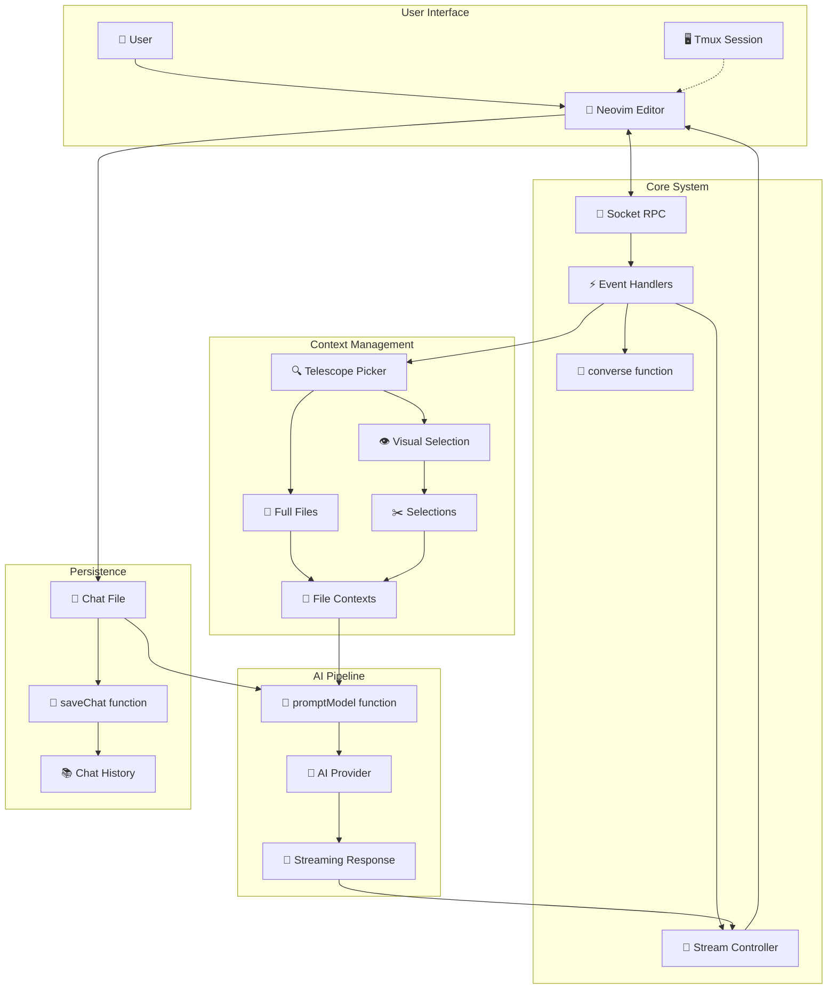

# 🤖 AI Chat System with Neovim Integration

A sophisticated AI interface built on Neovim with advanced file context management, streaming responses, persistent conversation history, and a Copilot SDK agent workflow with review-before-apply editing.

## ✨ Key Features

- **🖥️ Neovim-Native Interface**: Chat directly within Neovim with intuitive key bindings
- **📁 Smart File Context**: Add entire files or visual selections as context for AI conversations
- **⚡ Real-time Streaming**: Live AI response streaming with user-controlled abort capability
- **🔌 Multi-Provider Support**: Works with various AI model providers and models
- **🔍 Proposal Review Gate**: Review a git diff, edit proposal files, and explicitly apply or reject changes
- **💾 Persistent Sessions**: Automatic chat saving/loading with intelligent summarization
- **🔄 Tmux Integration**: Seamless tmux split-pane support
- **🎯 Visual Selection**: Select specific code portions using Neovim's visual mode
- **📊 Context Management**: Visual popup interface for managing file contexts
- **🌐 Built-in Web Tools**: Models can call `web_search` (Jina or DuckDuckGo) and `web_fetch` (with Jina Reader + Wayback fallbacks for JS/paywalled pages) directly from chat
- **🔎 Deep Search (opt-in)**: Models can call `deep_search({query, hint?})` to spawn an inner research loop using the SAME provider/model. The loop runs `web_search` + bulk scrape/index + vector query autonomously and returns ONE curated digest with citations — raw page bodies never enter the chat history. Configure via `[ai.chat.deepSearch]` in `settings.toml` (`enabled = true` to turn on).
- **🪜 Tool History**: `<leader>h` opens the same tool-call history popup the agent uses, showing every web call made in the conversation

## 🏗️ System Architecture



## ⌨️ Key Bindings & Controls

| Key | Action | Description |
|-----|--------|-------------|
| `⏎ Enter` | 🚀 Submit | Send message to AI (normal mode) |
| `@` | 📎 Add File | Open Telescope file picker for context (`<Tab>` multi-select, `+` marks selections) |
| `f` | 📂 Show Contexts | Display popup with active file contexts |
| `r` | 🗑️ Remove Context | Select and remove file from context |
| `Ctrl+X` | 🧹 Clear All | Remove all file contexts |
| `Ctrl+C` | ⏹️ Stop Stream | Abort AI response generation |
| `Space` | ✂️ Add Selection | Add visual selection to context (visual mode) |
| `<leader>h` | 🕶️ Tool History | Open the AgentToolHistory popup listing every web tool call (shared with agent mode) |

## 📁 File Context System

### 🎯 Context Types

#### 📄 Full File Context
```typescript
// Loads entire file content
{
  filePath: "/path/to/file.js",
  isPartial: false,
  summary: "Full file: file.js (150 lines)"
}
```

#### ✂️ Partial Context (Visual Selection)
```typescript
// User-selected text portions
{
  filePath: "/path/to/file.js",
  isPartial: true,
  startLine: 25,
  endLine: 40,
  summary: "Partial file: file.js (lines 25-40)"
}
```

### 🔄 Context Workflow

1. **📎 File Selection**: Telescope picker shows project files
2. **⚖️ Choice Dialog**: Choose between "entire file" or "partial selection"
3. **✂️ Visual Selection**: For partial - select text in visual mode, press `Space`
4. **💾 Context Storage**: Metadata stored in `fileContexts` array
5. **🤖 AI Integration**: Context automatically included in AI prompts

## 🚀 Core Functions

### `converse()` - Main Orchestrator
```typescript
async function converse(
    chatFile: string,
    temperature: number,
    role: string,
    provider: string,
    model: string,
    isChatLoaded = false
): Promise<void>
```

**Responsibilities:**
- 🏗️ Initialize chat session and file contexts
- 🖥️ Launch Neovim with custom configuration
- 🔌 Set up socket communication
- ⚙️ Configure event handlers and key bindings
- 💾 Manage session lifecycle

### File Context Management

#### `handleAddFileContext()`
- 🔍 Opens Telescope file picker
- ⚖️ Prompts user for context type choice
- 📄 Delegates to full or partial context handlers

#### `addEntireFileContext()`
- 📖 Reads complete file content
- 📊 Calculates file metrics (lines, size)
- 💾 Stores context metadata
- 📝 Appends context summary to chat

#### `addPartialFileContext()`
- 🖥️ Opens file in split window
- 👁️ Enables visual selection mode
- ⏰ Sets up temporary key bindings
- 📡 Uses RPC to capture selection
- 🧹 Cleans up mappings and functions

### Stream Management

#### `StreamController` Interface
```typescript
interface StreamController {
    abort: () => void;
    isAborted: boolean;
}
```

#### `handleStreamingResponse()`
- 📡 Processes async AI response chunks
- ⏱️ Buffers updates for smooth display
- ⏹️ Respects user abort signals
- 🔄 Updates Neovim buffer in real-time

## 💾 Chat Persistence System

### 🗃️ Data Structure
```typescript
interface FileContext {
    filePath: string;
    isPartial: boolean;
    startLine?: number;
    endLine?: number;
    summary: string;
}

interface ChatHistory {
    role: Role;
    message: string;
    timestamp: string;
}
```

### 💬 Chat File Format
```markdown
# AI Chat History

### USER (2024-01-15T10:30:00.000Z)
Hello, can you help me with this code?

📁 utils.js (45 lines, 2KB)
```javascript
// Full file content loaded: /path/to/utils.js
// File contains 45 lines of javascript code
```

### AI - gpt-4 (2024-01-15T10:30:15.000Z)
I'd be happy to help! I can see the utils.js file...
```

### 🔄 Context Reconstruction
The `rebuildFileContextsFromChat()` function parses saved chat files to restore file context state:
- 🔍 Scans for context markers (`📁`)
- 📊 Extracts file paths and line ranges
- 🏗️ Rebuilds `fileContexts` array
- ✅ Validates file accessibility

## 🛡️ Error Handling & Resilience

### 🚫 File Access Errors
- Graceful handling of unreadable files
- Clear error messages in context summaries
- Continuation of chat session despite file errors

### ⏹️ Stream Interruption
- User-controlled abort mechanism
- Clean termination of AI requests
- Status messages for stopped generations

### 🔌 Socket Communication
- Automatic socket path generation
- Connection timeout handling
- Proper cleanup on disconnect

### 🧹 Resource Management
- Temporary key binding cleanup
- Function definition cleanup
- Window management (split/close)

## 🎛️ Configuration & Setup

### 🔑 Key Dependencies
- `neovim`: Node.js Neovim client
- `telescope.nvim`: File picker interface
- Custom AI provider integration
- File system operations (`fs/promises`)

### ⚙️ Environment Integration
```typescript
// Tmux detection and integration
if (process.env.TMUX) {
    // Create tmux split-pane with Neovim
} else {
    // Launch standalone Neovim instance
}
```

### 🎨 Neovim Configuration
- Custom commands registered via RPC
- Syntax highlighting for code blocks
- Buffer-specific key mappings
- Popup window styling
- Dedicated proposal-review commands for Copilot SDK sessions

### 🌐 Web Tools

Chat models can call two web tools through the OpenAI function-calling interface during a turn:

- **`web_search(query, max_results?)`** — returns a ranked list of results with title, URL, and snippet.
- **`web_fetch(url, max_length?)`** — fetches a URL and returns plain text / Markdown of the main content (chrome stripped).

The model decides when to call them. A one-line marker is written into the chat file for each call (`` `✓ web_search: nodejs release notes` ``), and the full call/response history is available via `<leader>h` (the same `AgentToolHistory` popup the agent uses).

#### Search backend chain (`runWebSearch`)
1. **Jina Search** (`s.jina.ai`) — used when `JINA_API` env var is set. Reliable, JSON results, ~200 RPM with a key.
2. **DuckDuckGo Lite** (`lite.duckduckgo.com/lite/`) — fallback when no key is set or Jina fails. Free, no key, slim HTML layout.

#### Fetch backend chain (`runWebFetch`)
1. **Jina Reader** (`r.jina.ai/<url>`) — primary. Server-side renders the page (handles JS-only sites) and returns Markdown with links preserved, so the model can navigate index pages → articles. Anonymous tier ~20 RPM; with `JINA_API` set, ~200 RPM.
2. **Direct fetch** — fallback when Jina Reader fails or returns <200 chars. Plain `fetch()` against the origin, run through our own HTML → text extractor (`extractMainContent` + `htmlToText`).

Each fallback adds a `Fetched-Via:` line in the tool result so it's clear which path served the response.

#### Environment variables
| Variable | Purpose | Required? |
|----------|---------|-----------|
| `JINA_API` | Jina AI API key. Enables `s.jina.ai` for search and raises Reader limits to ~200 RPM. | Optional but strongly recommended — DuckDuckGo blocks cloud/repeated IPs aggressively. |

Get a free key at <https://jina.ai/> (10M tokens/month shared between Search + Reader on the free tier).

#### Token cost notes
Tool result blobs are **not** persisted to the saved chat file — they only live in the in-memory `messages` array for one turn. After the turn ends, only the model's own text remains. Within a turn, however, every prior tool result is re-sent on each subsequent API call (the OpenAI function-calling API is stateless), so a chained `search → fetch → fetch` turn can grow to 15–20k input tokens. OpenAI/DeepInfra auto-cache stable prefixes ≥1024 tokens at ~50% off, which absorbs most of the cost.


## 🔄 Session Lifecycle

1. **🚀 Initialization**
   - Create temporary chat file
   - Clear existing file contexts
   - Initialize chat header with controls

2. **🖥️ Neovim Launch**
   - Generate unique socket path
   - Launch Neovim with custom config
   - Wait for socket connection

3. **⚙️ Configuration**
   - Register RPC commands
   - Set up key bindings
   - Configure event handlers

4. **💬 Interactive Session**
   - User types messages and manages contexts
   - Real-time AI responses with streaming
   - Dynamic context management

5. **🧠 Agent Review Loop**
   - Agent writes changes directly to the repository as uncommitted diffs
   - Review the generated `git diff` in Neovim
   - Edit proposal files if needed
   - Apply or reject changes explicitly

6. **💾 Cleanup & Save**
   - Parse conversation history
   - Save chat with metadata
   - Clean up temporary files
   - Close socket connection

## 🎯 Advanced Features

### 🔍 Smart Context Display
- Full file contexts show summary only in chat
- Partial contexts display actual selected text
- Syntax highlighting based on file extension
- File size and line count metrics

### 📊 Visual Management
- Popup interface for context overview
- One-click context removal
- Real-time context status display
- Error indicators for inaccessible files

### ⚡ Performance Optimizations
- Buffered streaming updates
- Efficient file reading
- Minimal Neovim redraws
- Context caching during session

This system provides a powerful, developer-friendly interface for AI-assisted coding and conversation, seamlessly integrating file context management with the familiar Neovim editing environment.
