# Kra Workflow – Autosave Module
**Enterprise-grade automated workspace persistence with intelligent event coordination**
*Production-ready for Tmux/Neovim/Shell environments*

---

## 🎯 Architecture Overview

### 🚀 Unix Domain Socket IPC System
- **True Unix Domain Sockets** - Kernel-level inter-process communication with zero polling overhead
- **Event-driven messaging** - Instant event delivery via socket connections
- **Dual-script design** - Manager handles lifecycle, server processes events
- **Lock-based coordination** - Prevents conflicts with automatic stale lock cleanup

### 🛡️ Production-Ready Safety
- 🔒 **Multi-layer lock system** - `LoadInProgress`, `AutoSaveInProgress`, `ServerKillInProgress`
- ⏳ **Intelligent debouncing** - 20s configurable timeout prevents excessive saves
- 🚫 **Atomic operations** - Time-stamped event files prevent race conditions
- 🧹 **Automatic cleanup** - Stale lock detection with configurable TTLs
- 💀 **Graceful degradation** - Silent failures maintain system stability

### ⚡ Multi-Environment Integration
- **Tmux session management** - Complete lifecycle event coverage
- **Neovim buffer synchronization** - Smart buffer filtering with socket-based communication
- **Shell environment tracking** - Directory change detection (Zsh/Bash)

---

## 🔄 System Flow Architecture

The following diagram illustrates the complete event flow from trigger to save completion:

```mermaid
sequenceDiagram
    participant Hook as Event Source<br/>(Tmux/Shell/Neovim)
    participant Manager as AutoSave Manager<br/>(autoSaveManager.js)
    participant Lock as Lock System<br/>(File-based)
    participant Client as IPC Client
    participant Server as Autosave Script<br/>(autosave.js)
    participant Nvim as Neovim Sessions
    participant FS as File System

    Note over Hook: Event triggered (tmux hook, shell chpwd, neovim autocmd)
    Hook->>Manager: Execute with event args

    rect rgb(45,48,52)
        Note over Manager,Lock: Validation Phase
        Manager->>Manager: Check environment (TMUX, settings)
        Manager->>Lock: Check LoadInProgress/ServerKill locks
        alt Locks exist or not in TMUX or autosave inactive
            Manager->>Manager: Exit early
        end
    end

    rect rgb(50,47,45)
        Note over Manager,Server: Server Initialization
        Manager->>Lock: Check AutoSaveInProgress lock
        alt Autosave not running
            Manager->>Client: ensureServerRunning(autosave.js)
            Client->>Server: Spawn detached autosave process
            par
                Server->>Server: createIPCServer(AutosaveSocket)
            and
                Server->>Lock: createLockFile(AutoSaveInProgress)
            and
                Server->>Server: Start resetSaveTimer()
            end
        end
    end

    rect rgb(47,50,47)
        Note over Manager,Server: Event Processing
        Manager->>Client: emit(event)
        Client->>Server: Send event via Unix socket

        alt Event is 'FlushAutosave'
            Server->>Server: resetSaveTimer(1ms) - immediate save
        else Event starts with 'neovim'
            par
                Server->>Server: trackSession() - parse session info
            and
                Server->>Server: Store session data (socket, leave status)
            end
            Server->>Server: resetSaveTimer() - restart debounce
        else Other events
            Server->>Server: resetSaveTimer() - restart debounce
        end
    end

    rect rgb(50,47,47)
        Note over Server,FS: Save Process
        Note over Server: Debounce timer runs (default timeout)
        Server->>Server: Timer expires - begin save process

        loop For each tracked Neovim session
            alt Session marked as 'leave'
                Server->>FS: Delete session file
            else Active session
                Server->>Nvim: Connect via stored socket
                Server->>Nvim: Execute mksession command
                Server->>FS: Save session to nvimSessionsPath
            end
        end

        Server->>FS: quickSave() - save tmux state
        Server->>Lock: deleteLockFile(AutoSaveInProgress)
        Server->>Server: Close IPC server + Exit process
    end
```



---

## 🏗️ Technical Implementation

### Dual-Script Architecture
```typescript
// Manager (autoSaveManager.js) - Event detection & server lifecycle
if (!await lockFileExist(LockFiles.AutoSaveInProgress)) {
    await client.ensureServerRunning(autosaveScript);
}
await client.emit(event);

// Server (autosave.js) - Event processing & save orchestration
server.addListener(async (event) => {
    if (event.startsWith('neovim')) {
        trackSession(event); // Parse session:window:pane:event:socket
    }
    resetSaveTimer(); // Debounce with configurable timeout
});
```

### Unix Socket IPC Architecture
```typescript
// Server - Event-driven socket listener
const server = net.createServer((socket) => {
    socket.on('data', (data) => {
        const event = data.toString().trim();
        handler(event); // Immediate processing
    });
});
server.listen(socketPath); // /tmp/autosave.sock

// Client - Direct socket connection
const client = net.createConnection(socketPath);
client.write(event);
client.end();
```

### Lock System with TTL
```typescript
const timeouts = {
    LoadInProgress: 10000,        // 10s - Loading operations
    AutoSaveInProgress: await loadSettings().then((set) => set.autosave.timeoutMs) + 10000, // autosave timeout + 10 sec buffer
    ServerKillInProgress: 5000    // 5s - Kill operations
};

// Automatic stale lock cleanup
if (lockInfo.timestamp < Date.now() - timeouts[type]) {
    await deleteLockFile(type);
    return false;
}
```

---

## ⚙️ Event Sources & Integration

### Tmux Hooks (Complete Lifecycle Coverage)
```bash
# Session Management
tmux set-hook -g session-created "run-shell \"node $MANAGER tmux\""
tmux set-hook -g session-closed "run-shell \"node $MANAGER tmux\""
tmux set-hook -g after-rename-session "run-shell \"node $MANAGER tmux\""

# Window Operations
tmux set-hook -g after-new-window "run-shell \"node $MANAGER tmux\""
tmux set-hook -g after-rename-window "run-shell \"node $MANAGER tmux\""

# Pane Management
tmux set-hook -g after-split-window "run-shell \"node $MANAGER tmux\""
tmux set-hook -g after-kill-pane "run-shell \"node $MANAGER tmux\""
tmux set-hook -g pane-exited "run-shell \"node $MANAGER tmux\""
```

### Shell Environment Integration
| Shell | Hook Mechanism | Event Trigger |
|-------|---------------|---------------|
| **Zsh** | `chpwd()` function override | Directory change |
| **Bash** | `PROMPT_COMMAND` with PWD tracking | Command completion |

### Neovim Smart Buffer Tracking
```lua
-- Intelligent buffer filtering
local excluded_filetypes = {
    "NvimTree", "TelescopePrompt", "fugitive", "oil", "trouble",
    "lazy", "mason", "alpha", "dashboard", -- [38 total exclusions]
}

-- Event debouncing with buffer change detection
local function schedule_autosave(event_name)
    debounce_timer = vim.loop.new_timer()
    debounce_timer:start(500, 0, vim.schedule_wrap(function()
        if buffers_changed(visible_file_buffers, get_current_file_buffers()) then
            execute_script(event_name)
        end
    end))
end
```

---

## 🛡️ Reliability & Safety Features

### 1. **Multi-Layer Lock Coordination**
```typescript
// Prevents conflicts between operations
if (await oneOfMultipleLocksExist([
    LockFiles.LoadInProgress,
    LockFiles.ServerKillInProgress
])) {
    process.exit(0); // Silent failure
}
```

### 2. **Session State Management**
```typescript
// Tracks Neovim sessions with leave detection
nvimSessions[sessionKey] = {
    socket: extractedSocket,
    leave: neovimEvent === "VimLeave"
};

// Handles cleanup vs. save logic
if (neovimEvent.leave) {
    await fs.unlink(sessionFile); // Clean up closed sessions
} else {
    await neovim.command(`mksession! ${sessionPath}`); // Save active sessions
}
```

### 3. **Automatic Server Lifecycle**
```typescript
// PID-based server detection
const isServerRunning = (): boolean => {
    try {
        const pid = parseInt(fs.readFileSync(pidFile, 'utf8'));
        process.kill(pid, 0); // Throws if process dead
        return true;
    } catch (e) {
        fs.unlinkSync(pidFile); // Clean stale PID file
        return false;
    }
};
```

---

## 📊 Performance Characteristics

✅ **Instant event processing** - Unix socket kernel-level IPC with zero polling overhead
✅ **On-demand server spawning** - Zero idle processes when inactive
✅ **Smart debouncing** - 20s default prevents save storms during rapid changes
✅ **Memory efficient** - Direct socket communication, no temporary files
✅ **Fault tolerant** - Multiple validation layers with graceful degradation

---

## 🔧 Installation & Setup

### Automated Installation
The autosave module installs automatically as part of the Kra Workflow setup:

### Manual Setup (if needed)
```bash
# Install Neovim integration
cp ~programming/kra-tmux/automationScripts/hooks/neovimHooks.lua ~/.config/nvim/lua/
echo 'require("neovimHooks")' >> ~/.config/nvim/init.lua

# Install shell hooks
source ~/programming/kra-tmux/automationScripts/source-all.sh

# Reload shell configuration
source ~/.bashrc
# or
source ~/.zshrc

```
### Configuration
```yaml
# settings.yaml
autosave:
  active: true
  currentSession: "auto-updated-on-load-save"
  timeoutMs: 20000  # 20 second debounce window
```

---

## 🎯 Key Technical Achievements

1. **Unix Domain Socket IPC** - Kernel-level inter-process communication with zero overhead
2. **Multi-environment State Synchronization** - Seamless Tmux↔Neovim↔Shell integration
3. **Production-Grade Error Handling** - Multiple validation layers with silent degradation
4. **Smart Buffer Management** - 38 excluded filetypes with change detection
5. **Lock-Based Coordination** - TTL-based cleanup prevents stale state issues

---

## 🔍 Troubleshooting

### Common Issues

**Events not triggering:**
```bash
# Verify settings
kra settings
```

**Server not starting:**
```bash
# Check for stale locks
ls ~/programming/kra-tmux/lock-files

# Manual cleanup if needed - very unlikely
rm -f ~/programming/kra-tmux/lock-files
```

**Neovim integration not working:**
```bash
# Verify Lua file exists
ls ~/.config/nvim/lua/neovimHooks.lua

# Check init.lua includes the requirement
grep neovimHooks ~/.config/nvim/init.lua
```

---

## 📈 Impact & Benefits

**For Development Teams:**
- Eliminates work loss from unexpected crashes or system reboots
- Maintains complete session state across environment changes
- Enables seamless workspace handoff between team members

**Technical Excellence:**
- Demonstrates advanced Node.js process coordination patterns
- Shows deep understanding of Unix system programming concepts
- Exhibits enterprise-ready error handling and fault tolerance

---

*Part of the comprehensive Kra Workflow productivity ecosystem*
