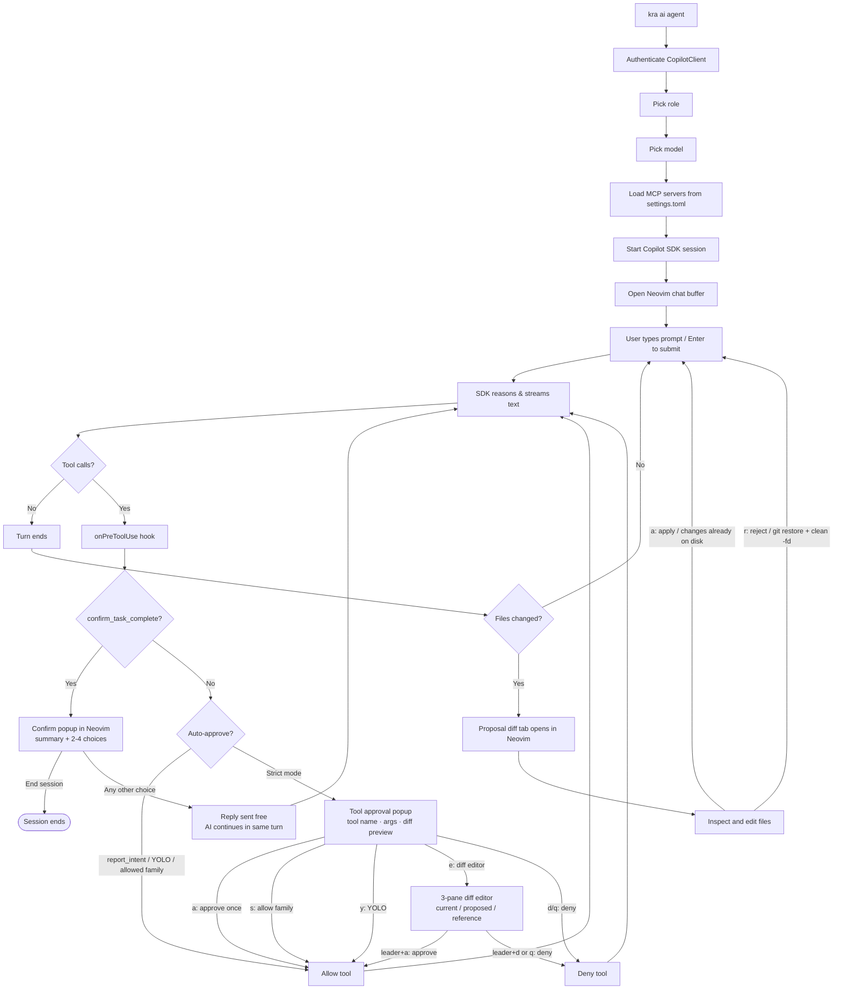

# 🤖 Copilot Agent Mode

A full agentic workflow powered by the **GitHub Copilot SDK**, integrated directly into Neovim. The agent reasons, calls tools, edits files, runs shell commands, and queries MCP servers. Changes land as uncommitted git diffs that you inspect in Neovim before deciding to keep or discard them.

## 📋 Table of Contents

- [Quick Start](#-quick-start)
- [How It Works](#-how-it-works)
- [Architecture](#-architecture)
- [Model Selection](#-model-selection)
- [Key Bindings](#️-key-bindings)
- [Tool Approval](#-tool-approval)
- [File Editing Tools (kra-file-context MCP)](#-file-editing-tools-kra-file-context-mcp)
- [Session Diff History](#-session-diff-history)
- [Skills](#-skills)
- [MCP Server Configuration](#-mcp-server-configuration)
- [Quota Monitoring](#-quota-monitoring)


## 🚀 Quick Start

```bash
kra ai agent
```

This opens a Neovim chat buffer. Type your prompt below the draft header and press **Enter** in normal mode to submit.

---

## 🏗 How It Works

### Proposal Workspace

The agent works directly inside your repository, writing changes as **uncommitted git diffs**. Nothing is staged or committed automatically — every change is visible via `git status` and `git diff` at any time.

```
Your repository
───────────────
src/            ← agent edits files here (uncommitted)
package.json    ← changes visible as git diff
```

When the agent finishes a turn that changed files, **the diff opens automatically** in a Neovim tab for review.

- **Apply** (`<leader>a`) — changes are already on disk; this just confirms you're happy with them.
- **Reject** (`<leader>r`) — runs `git restore . && git clean -fd` to discard all uncommitted changes.

### Session Lifecycle

1. **Start** — `kra ai agent` starts the Copilot SDK session and opens Neovim
2. **Turn** — You submit a prompt; the agent reasons and calls tools (with your approval in strict mode)
3. **Review** — If files changed, the proposal diff tab opens. Inspect, edit files, then apply or reject
4. **Apply** — `<leader>a` (or `a` in the diff tab) acknowledges the changes (already written to disk)
5. **Continue** — Submit the next prompt; changes accumulate as uncommitted diffs across turns
6. **End session** — When the agent calls `confirm_task_complete` and you select "End session", the session closes

### Confirm-Before-Done Protocol

The agent is instructed to always call `confirm_task_complete` before ending a turn. This presents a popup with a summary and 2–4 choices. Selecting a choice sends your reply back to the agent. Only "End session" terminates the turn.

---

## 🗺 Architecture

The diagram below shows the full turn lifecycle — from submitting a prompt to the proposal diff review.



---

## 🎯 Model Selection

On startup, the agent checks `settings.toml` for a default model:

```toml
[ai.agent]
defaultModel = "gpt-5-mini"
```

If no default is set (or the model isn't available), an interactive picker shows all available Copilot models. Each entry is annotated with:

- `[DISABLED]` — the model is currently unavailable
- `[xN]` — the billing multiplier (premium interaction cost) when greater than 1

After choosing a model, if it advertises multiple reasoning efforts (e.g. `low`, `medium`, `high`, `xhigh`), a second picker prompts for the desired effort. The model's recommended effort is marked `(default)`.

---

## ⌨️ Key Bindings

### Chat Buffer

| Key | Action |
|-----|--------|
| `Enter` | Submit prompt |
| `Ctrl+C` | Stop current agent turn |
| `@` | Add file context (Telescope picker) |
| `r` | Remove a file from context |
| `f` | Show active file contexts popup |
| `Ctrl+X` | Clear all file contexts |
| `<leader>o` | Open a changed proposal file |
| `<leader>a` | Apply proposal to the repository |
| `<leader>r` | Reject / discard proposal changes |
| `<leader>y` | Toggle YOLO mode (auto-approve all tools) |
| `<leader>P` | Reset remembered per-family tool approvals |
| `<leader>h` | Browse tool call history for this session |
| `<leader>s` | Browse session diff history (all AI write diffs) |
| `<Space>t` | Toggle tool/intent popups on or off (global keymap) |
| `<leader>?` | Show all keymaps (which-key) |

> **Note:** The proposal diff opens automatically after each turn that modifies files. `<leader>o/a/r` let you re-trigger those actions from the chat buffer if you've closed the diff tab.

#### Tool Call History (`<leader>h`)

Opens a searchable Telescope picker listing every tool invoked during the session — name, started/updated time, and success/failure status. The preview pane shows the tool's **result** (output) for the highlighted entry. Press `<CR>` to open a read-only side-by-side view in a new tab: the **arguments JSON** (as the agent sent them) on the left, and the **tool result** on the right. Inside the view, `q` closes the tab and `<Tab>` / `<S-Tab>` switch focus between the two panes. The history is view-only — tools cannot be re-run from here.

### Proposal Review Tab

The diff tab opens automatically. It has its own local keymaps:

| Key | Action |
|-----|--------|
| `a` | Apply proposal to repository |
| `r` | Reject proposal |
| `o` | Open a changed file (Telescope picker) |
| `R` | Refresh the diff |
| `q` | Close the tab |

### Tool Approval Popup

When the agent requests permission to run a tool (strict mode):

| Key | Action |
|-----|--------|
| `<CR>` | Run the currently highlighted action (same as pressing its letter) |
| `<Up>` / `<Down>` | Move the highlight between actions |
| `a` | Approve this tool call once |
| `s` | Allow this **tool family** for the rest of the session |
| `y` | Enable **YOLO mode** — approve everything automatically |
| `e` | Open the **diff editor** to review/edit the proposed change (file writes only — falls back to JSON editor for other tools) |
| `J` / `<leader>j` | Open the raw tool JSON args in an editor (only when a write preview is shown) |
| `d` / `q` | Deny this tool call |

#### Diff Editor (after pressing `e`)

A three-pane diff view (current ← proposed → reference):

| Key | Action |
|-----|--------|
| `<leader>a` | Approve the (possibly edited) proposed content |
| `<leader>d` | Deny |
| `<leader>j` | Edit the raw tool JSON arguments |
| `q` | Close and deny |

---

## 🔐 Tool Approval

### Auto-Approved Tools

Some tools are always allowed silently, without showing a popup:

| Tool | Reason |
|------|--------|
| `report_intent` | Status-reporting only — no side effects |
| `confirm_task_complete` | Handled by the confirm-before-done popup, not the approval flow |

### Strict Mode (default)

Every other tool call shows a popup. You see the tool name, arguments, and — for file writes — a diff preview. Choose to:

- **Approve once** (`a`) — allow just this call
- **Allow family** (`s`) — remember approval for all tools of the same type (e.g., all shell commands) for this session
- **YOLO mode** (`y`) — disable approval prompts entirely until you reset (`<leader>P`)

### YOLO Mode

All tool calls are approved automatically. File writes still go directly to the repository. Toggle with `<leader>y`; reset with `<leader>P`.

---

## 🛠 File Editing Tools (kra-file-context MCP)

The agent has a built-in MCP server (`kra-file-context`) that exposes precise, line-range based file editing tools. To force the agent to use these — instead of fuzzy string-replacement tools — the SDK's stock editing tools are **excluded**:

```
excludedTools: ['str_replace_editor', 'write_file', 'read_file', 'edit']
```

The agent must use the following tools instead:

| Tool | Purpose |
|------|---------|
| `get_outline(file_path)` | Returns a structured outline (functions, classes, methods + line numbers). Cheap way to understand a large file before reading it. |
| `read_lines(file_path, start_line, end_line)` | Read a specific line range (1-indexed, inclusive). |
| `read_lines(file_path, startLines[], endLines[])` | **Array form** — read multiple ranges in one call (parallel arrays). |
| `read_function(file_path, function_name)` | Look up a symbol by name and return its full body. |
| `edit_lines(file_path, start_line, end_line, new_content)` | Replace a line range with new content. Empty `new_content` deletes the lines. Returns the old content for verification. |
| `edit_lines(file_path, startLines[], endLines[], newContents[])` | **Array form** — apply multiple edits in one call. Line numbers refer to the original file; the tool sorts ranges bottom-to-top internally and rejects overlapping ranges. |
| `create_file(file_path, content)` | Create a new file (or overwrite an existing one). Parent directories are created automatically. |

### Why line ranges instead of string replacement?

Line-range edits are precise and never fail due to stale `old_str` context. The recommended workflow is:

1. `get_outline` → understand the file
2. `read_lines` → confirm the exact lines to change
3. `edit_lines` → replace them

For multi-section reads/edits, **always prefer the array form** over multiple sequential calls.

---

## 📜 Session Diff History

Every write the agent performs (`edit_lines`, `create_file`, etc.) is recorded in a session-scoped diff history. Press `<leader>s` in the chat buffer to open a Telescope picker showing:

- **One entry per write** — the diff that was actually applied at that point in the session
- **One `ORIG` entry per unique file** — the diff between the file's pre-session baseline and its current state

Select any entry to open the diff in a new tab. The `ORIG` entries make it easy to revert a single file to how it was before the session started, even after many edits.

---

## 🎓 Skills

The agent loads skills from `<repo>/skills/` via the SDK's `skillDirectories` option. Skills are reusable instruction sets / prompt fragments that the agent can pull in on demand (file format and discovery follow the Copilot SDK skill convention).

Drop a skill folder into `skills/` and it becomes available the next time you start `kra ai agent`. The directory does not exist by default — create it when you have skills to register.

---

## 🔌 MCP Server Configuration

MCP servers extend the agent with custom tools. Configure them in `settings.toml`:

```toml
[ai.agent.mcpServers.filesystem]
active = true
type = "local"
command = "npx"
args = ["-y", "@modelcontextprotocol/server-filesystem", "."]
tools = ["*"]

[ai.agent.mcpServers.github]
active = true
type = "local"
command = "npx"
args = ["-y", "@modelcontextprotocol/server-github"]
tools = ["search_repositories", "get_file_contents"]
```

See `settings.toml.example` for a full reference. Only servers with `active = true` are injected into the session.

---

## 📊 Quota Monitoring

### Check Quota On Demand

```bash
kra ai quota
```

Shows two sections:

**Monthly (live from GitHub API)**
```
Copilot Quota — Monthly
  Resets on: June 1, 2026

  Premium interactions:
    ████████████░░░░░░░░░░░░░░░░░░ 42.3% remaining
    173 / 300 used  (127 left)
```

**Weekly/Session (cached from last session)**
```
Copilot Quota — Usage Limits (last session)

  Weekly:
    ██████████████████████░░░░░░░░ 73.5% remaining
    Resets: Jun 7, 2025  (12m ago)
```

> Weekly and session limits come from API response headers — they're only observable during active sessions. The cache is updated automatically after each agent turn.

### In-Session Warnings

The agent warns in the terminal (not Neovim) when weekly or session quota drops to **50%**, **25%**, and **10%**:

```
⚠ You've used over 75% of your weekly usage limit. Resets: Sat, Jun 7, 2026, 12:00 AM
```

Yellow at 50%/25%, red at 10%.
