# 🚀 Kra Workflow

**Enterprise-grade development productivity suite** — A powerful collection of integrations designed to supercharge your development workflow with **seamless terminal integrations**, **intelligent automation**, and **AI-powered assistance**.

## ⭐ **Flagship Features**

### 💾 [**Enterprise Autosave System**](AUTOSAVE.md)
*Unix domain socket-based workspace persistence with zero-overhead event coordination*
- **⚡ Instant event processing** via kernel-level IPC communication
- **🛡️ Production-ready reliability** with multi-layer lock coordination
- **🔄 Complete state synchronization** across Tmux/Neovim/Shell environments
- **🎯 Smart debouncing** groups events during activity and flushes them once inactive

### 🤖 [**AI Chat System with Neovim as Interface**](AI-CHAT-BOT.md)
*Revolutionary AI conversation interface with advanced file context management*
- **📝 Neovim-native chat interface** with real-time streaming responses
- **📁 Intelligent file context system** - Add entire files or visual selections
- **💾 Smart conversation persistence** with AI-generated summaries
- **🔄 Multi-provider support** (OpenAI, Anthropic, Gemini, etc.)

### 🧠 [**Agent Mode (Copilot + BYOK)**](AGENT.md)
*Full agentic workflow with two interchangeable backends and a review-before-apply repository workspace*
- **🔀 Two providers behind one command** — GitHub Copilot SDK *or* any OpenAI-compatible API (OpenAI, DeepSeek, Gemini, OpenRouter, DeepInfra, Mistral) via BYOK
- **📚 Live model catalog** — models fetched from each provider on demand, annotated with context window + per-token pricing, cached for 24h
- **🔍 Repo-as-workspace** — the agent edits files directly as uncommitted git diffs; you review before applying
- **✏️ Inline diff editor** — edit the agent's proposed change in a 3-pane diff before approving; choose whether the AI gets notified of your edits
- **📜 Per-file revert** — session diff history with one `ORIG` entry per file lets you roll back any single file to its pre-session baseline
- **🛡️ Tool approval** — approve each tool call, allow by family, or go YOLO
- **🔌 MCP server support** — extend either provider with custom tools via `settings.toml`; BYOK auto-loads `kra-bash` + `kra-web`
- **🧠 Persistent project memory + multi-codebase semantic search (`kra-memory` MCP)** — local LanceDB + on-device fastembed, `remember` / `recall` / `update_memory` carry design decisions, gotchas, and follow-ups across sessions and compaction. `semantic_search` can search code by concept when the repo is indexed **and** search all long-term memories with `memoryKind: 'findings'`; memory reads are intercepted through a Telescope picker so you choose which entries the agent actually receives. Code indexing stays opt-in per launch and is tracked in a central registry (`~/.kra-memory/registry.json`) keyed by git origin so identity survives renames and re-clones. Catch-up reindex on launch (`git diff` + `status` union) covers edits made between sessions; `kra memory` is a blessed UI to manage memories, docs sources, search, and every indexed repo from one place
- **📊 Copilot quota monitoring** — live monthly usage + cached weekly/session limits with terminal warnings at 50%/25%/10%
---

## 🎯 **Core Philosophy**

**Zero-overhead productivity** - No background processes unless you're making meaningful changes to your tmux session or actively using the tool.

With **on-demand activation** and **intelligent event-driven architecture**, Kra provides seamless terminal integrations including Tmux server management, Git operations, intelligent workspace persistence, and an AI chatbot interface — all with enterprise-grade reliability and **zero idle resource consumption**.

### **🌟 Design Principles**
- 🔋 **Zero background overhead** - Processes spawn only when needed, terminate when idle
- 🎯 **Event-driven activation** - Responds instantly to meaningful workspace changes
- 🔍 **Grep-searchable interfaces** - Lightning-fast access to any functionality
- ⌨️ **Full tab autocompletion** - Efficient, intuitive terminal interactions
- 🎨 **Modern terminal UI** - Rich formatting with zero persistent processes
- 🚀 **Zero-configuration** - Intelligent defaults with automatic cleanup

**The Result:** Effortlessly switch between projects, manage Git workflows, chat with AI, and maintain perfect workspace state — all from your terminal with **maximum performance and minimal system impact**. This comprehensive suite helps you work smarter, faster, and with complete confidence in your system's efficiency.

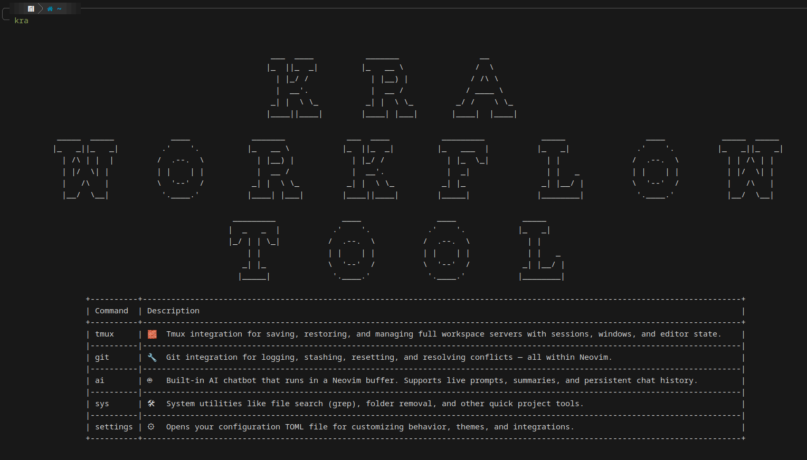

---

## 📚 **Complete Feature Set**

### 🖥️ [Tmux Integration](#tmux-integration)
*Complete server lifecycle management with persistent state*

### 🌿 [Git Integration](#git-integration)
*Advanced source control with conflict resolution and branch management*

### 🤖 [AI Chatbot Integration](#ai-chatbot-integration)
*Intelligent conversation system with file context awareness*

### ⚡ [Autosave System](#autosave-system)
*Enterprise-grade automated workspace persistence*

### 🛠️ [System Utilities](#system-utilities)
*Developer productivity tools and utilities*

---

## 🖥️ Tmux Integration

**Enterprise-grade tmux server management** engineered to give you complete control over your development sessions with **persistent workspace state**.

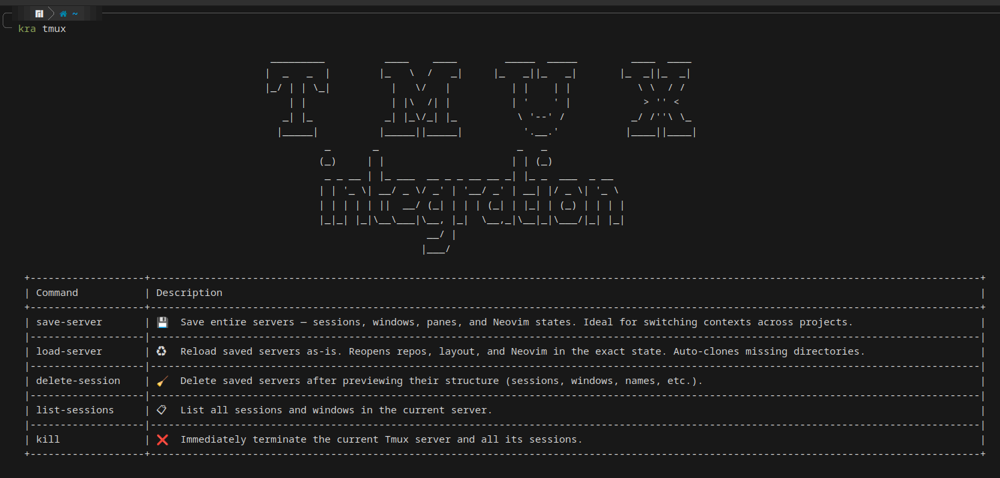

> 📦 **Access via:**
```bash
kra tmux
```

### 🛠️ **Available Commands**
| Command            | Description                                                                                                                                        |
| ------------------ | -------------------------------------------------------------------------------------------------------------------------------------------------- |
| **save-server** 💾    | Save entire servers — including all sessions, windows, panes, and Neovim states. Perfect for multitasking across different projects or tickets. |
| **load-server** ♻️    | Reload your saved server *exactly* how you left it — including repos (auto-clones if missing), directories, layouts, and editor states.         |
| **delete-server** 🧹  | Clean up specific saved servers. Preview the structure (sessions, windows, names) before confirming deletion.                                   |
| **list-sessions** 📋  | View a summary of the current server's sessions and windows with rich formatting.                                                                    |
| **kill** ❌           | Terminate the currently running server instantly with graceful cleanup.                                                                                                |

### **Demo Previews** - *Click to expand*
<details>
<summary>💾 <strong>kra tmux save-server</strong> - Complete workspace persistence</summary>

Saves the current tmux server, including all sessions, windows (with their names), panes (with sizes and positions), and active Neovim sessions with intelligent state tracking.


</details>

<details>
<summary>♻️ <strong>kra tmux load-server</strong> - Instant workspace restoration</summary>

Select a saved tmux server from a searchable list to load. Automatically runs configured build/watch commands and restores complete development environment state.


</details>

<details>
<summary>🧹 <strong>kra tmux delete-server</strong> - Safe server cleanup</summary>

Intelligently displays server structure with sessions, windows, and panes count, then confirms deletion with detailed preview.

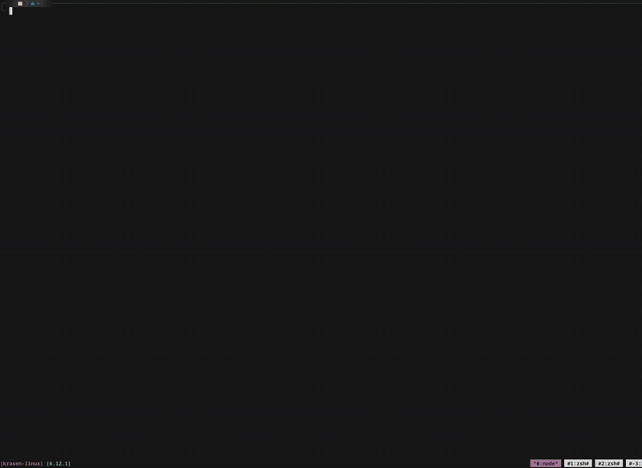
</details>

---


## 🤖 AI Chatbot Integration

**Revolutionary AI conversation system** with **Neovim-native interface**, **advanced file context management**, and **intelligent conversation persistence**.

> 🎯 **[Complete AI Chat System Documentation →](AI-CHAT-BOT.md)**

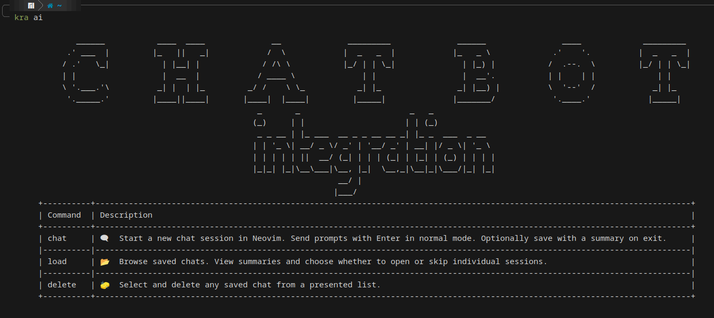

> 📦 **Access via:**
```bash
kra ai
```

### 🛠️ **Available Commands**
| Command    | Description                                                                                                                                                                                                                       |
| ---------- | --------------------------------------------------------------------------------------------------------------------------------------------------------------------------------------------------------------------------------- |
| **chat** 🗨️   | Launch new AI chat session in Neovim with **real-time streaming**, **file context management**, **built-in web tools** (`web_search` + `web_fetch` with Jina / DuckDuckGo / Wayback fallbacks), and **socket-based communication**. Press `Enter` in normal mode to send prompts; press `<leader>h` to inspect the tool-call history. Provider models are sourced from the same **live catalog** the agent uses (cached 24h, network-free fallback). |
| **agent** 🧠 | Launch an agent session in Neovim with a **provider picker** (Copilot SDK *or* BYOK / OpenAI-compatible), **project-local MCP servers**, an **inline diff editor**, and **per-file revert** from session diff history. |
| **load** 📂   | Browse saved conversations with **AI-generated summaries**. Preview summaries before loading full chat sessions.                                                                                                              |
| **delete** 🧽 | Manage saved chats with **searchable deletion interface** and confirmation prompts.                                                                                                        |

### **Key Technical Features**
- ⚡ **Real-time streaming responses** with user-controlled abort capability
- 📁 **Advanced file context system** - Add entire files or visual selections as context
- 🌐 **Built-in web tools in chat** - Models can call `web_search` and `web_fetch` mid-conversation. Search uses **Jina → DuckDuckGo Lite**; fetch uses **Jina Reader → direct** (handles JS-rendered and paywalled pages). Set `JINA_API` to enable the Jina backends.
- 🧠 **Multi-provider AI support** - OpenAI, Anthropic, Gemini, and custom providers
- 🤖 **Agent mode (Copilot + BYOK)** — Agentic tool use, MCP support, an inline diff editor, and interactive ask-user requests inside Neovim
- 💾 **Intelligent conversation persistence** with automatic summary generation
- 🎯 **Visual selection integration** - Select code portions directly in Neovim
- 🔄 **Session restoration** with complete context reconstruction

### **Demo Previews** - *Click to expand*
<details>
<summary>🗨️ <strong>kra ai chat</strong> - Complete chat workflow</summary>

**Multi-step chat initialization:**
1. **Role Selection** - Choose from preconfigured roles or define custom ones
2. **Provider Selection** - Pick from available AI providers with model options
3. **Temperature Control** - Fine-tune response creativity (0-10 scale, 0-20 for Gemini)
4. **Interactive Session** - Real-time conversation with streaming responses

**Advanced Features:**
- Socket-based Neovim integration for instant response delivery
- File context management with visual selection support
- Edit messages and responses before sending or saving
- Complete conversation control with context manipulation

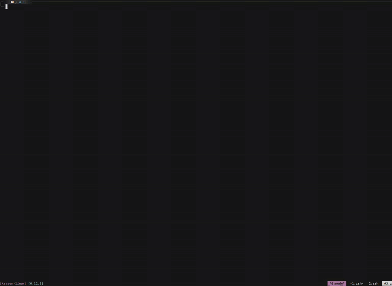
</details>

<details>
<summary>🧠 <strong>kra ai agent</strong> - Agent workflow (Copilot + BYOK)</summary>

**Agent-first coding workflow:**
1. **Provider selection** — pick `copilot` (GitHub Copilot SDK) or `byok` (any OpenAI-compatible API)
2. **Model selection** — live catalog with context window + pricing annotations; Copilot also picks a reasoning effort.
3. **Repo workspace** — the agent writes changes directly to your repo as uncommitted git diffs; nothing is staged automatically
4. **Diff review in Neovim** — review the generated `git diff`, optionally edit the agent's proposed change in the 3-pane diff editor, then explicitly apply or reject
5. **Per-file revert** — `<leader>s` opens session diff history with an `ORIG` entry per file so you can undo a single file at any time

**MCP configuration:**
- Define MCP servers under `ai.agent.mcpServers.*` in `settings.toml`
- Active servers are injected into both providers automatically
- BYOK additionally auto-loads `kra-bash` (shell) and `kra-web` (`web_fetch` / `web_search`) since BYOK has no built-in tools
- Copilot also accepts remote (`http`/`sse`) MCP servers; BYOK only spawns local stdio servers
</details>

<details>
<summary>💾 <strong>Intelligent chat saving</strong> - AI-powered summarization</summary>

**Automatic conversation persistence:**
- Prompt to save on chat exit with Y/N confirmation
- **Gemini-powered summarization** utilizing large context window
- **Editable summaries** - Review and modify before final save

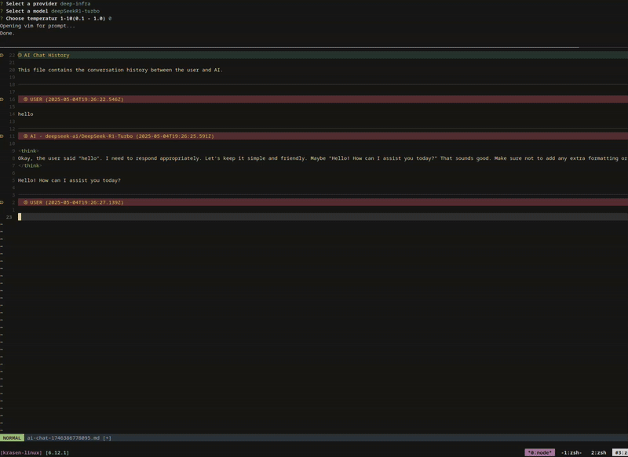
</details>

<details>
<summary>📂 <strong>kra ai load</strong> - Smart conversation browsing</summary>

**Intelligent chat loading workflow:**
- Searchable list of saved conversations with timestamps
- **Summary preview** in Neovim before loading full chat
- **Context reconstruction** - Rebuilds file contexts automatically
- **Seamless continuation** - Resume exactly where you left off


</details>

<details>
<summary>🧽 <strong>kra ai delete</strong> - Safe chat management</summary>

Searchable deletion interface with **confirmation prompts** and **permanent removal warnings**.

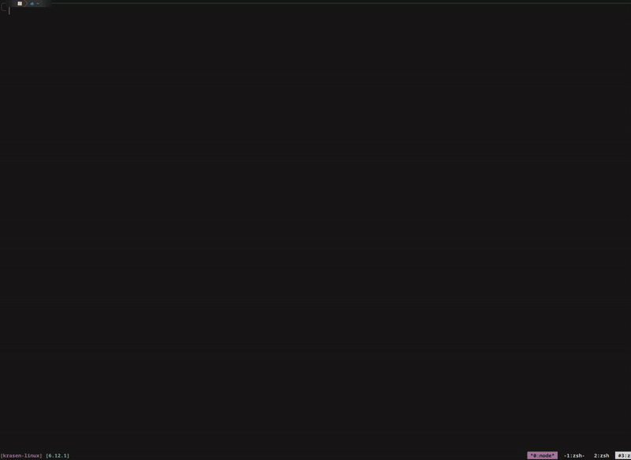
</details>

---

## ⚡ Autosave System

**Enterprise-grade automated workspace persistence** with **Unix domain socket IPC** and **intelligent event coordination** across your entire development environment.

> 🎯 **[Complete Autosave System Documentation →](AUTOSAVE.md)**

### 🚀 **Core Architecture**
- **⚡ Unix Domain Socket IPC** - Kernel-level inter-process communication with zero polling overhead
- **🛡️ Multi-layer lock coordination** - Production-ready safety with automatic stale lock cleanup
- **🎯 Smart event debouncing** - Configurable 20s timeout prevents excessive saves
- **🔄 Multi-environment sync** - Seamless Tmux↔Neovim↔Shell state coordination

### 🏗️ **Technical Highlights**
- **Event-driven architecture** with instant processing via Unix sockets
- **Intelligent session tracking** with automatic cleanup for closed Neovim instances
- **Production-grade error handling** with graceful degradation and silent failures
- **Smart buffer filtering** - Excludes 38+ utility buffer types for clean state saves

### 📊 **Supported Event Sources**
| Environment | Integration Method | Events Tracked |
|-------------|-------------------|----------------|
| **Tmux** | Native hooks system | Session/window/pane lifecycle events |
| **Neovim** | Lua autocmd integration | Buffer changes, session enter/leave |
| **Shell** | Zsh/Bash hook override | Directory changes, command completion |

### ⚙️ **Configuration**
```yaml
# settings.yaml
autosave:
  active: true                    # Enable/disable autosave
  currentSession: "auto-managed"  # Current session tracking
  timeoutMs: 20000               # 20s debounce window
```

---

## 🌿 Git Integration

**Advanced Git workflow management** designed to facilitate efficient source control with **intelligent conflict resolution** and **branch lifecycle management**.

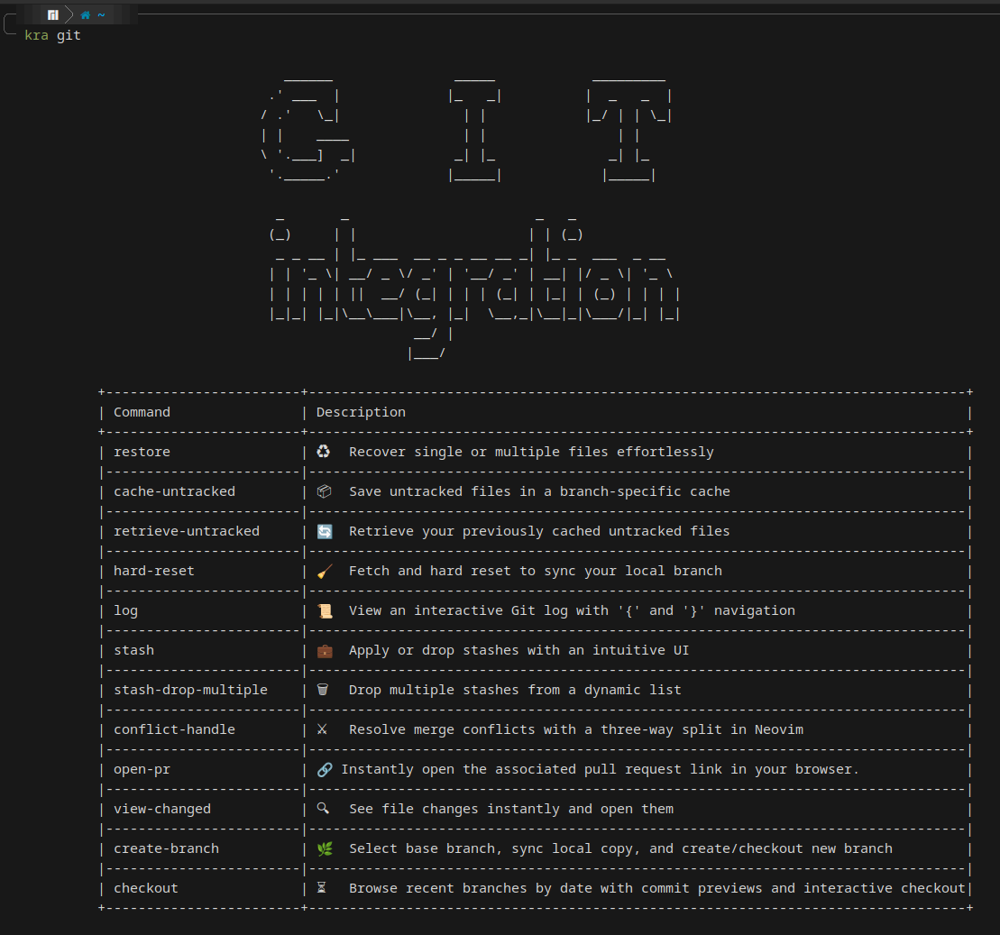

> 📦 **Access via:**
```bash
kra git
```

### 🛠️ **Available Commands**
| Command                 | Description                                                                                                                  |
| ----------------------- | ---------------------------------------------------------------------------------------------------------------------------- |
| **restore** ♻️           | Recover single or multiple files effortlessly with intelligent selection interface.                                                                            |
| **cache-untracked** 📦   | Save untracked files in a branch-specific cache with automatic organization and retrieval.  |
| **retrieve-untracked** 🔄 | Retrieve your previously cached untracked files with branch-aware restoration.                                                                          |
| **hard-reset** 🧹        | Perform intelligent `git fetch --prune` and hard reset to keep local branches clean and synchronized.                                 |
| **log** 📜              | View a rich, navigable Git log inside Neovim with optimized commit navigation (`{` and `}` keys).                               |
| **stash** 💼            | Apply or drop stashes using an intuitive, searchable selection interface.                                                             |
| **stash-drop-multiple** 🗑️ | Select and drop multiple stashes efficiently with dynamic list updates.                                                           |
| **conflict-handle** ⚔️   | Resolve merge conflicts seamlessly in Neovim with three-way split and automatic conflict scanning.                     |
| **open-pr** 🔗          | Instantly open associated pull request links in your browser with GitHub/Bitbucket support.                                                          |
| **view-changed** 🔍      | Instantly inspect file changes with integrated diff viewer and smart file management.                                                                  |
| **create-branch** 🌿     | Checkout base branch with automatic sync, fetch/prune, hard reset, then create and switch to new branch.                                               |
| **checkout** ⏳          | Filter branches by activity date with dynamic search and smart stash handling.                                                  |
| **reflog** 🧭            | Browse the reflog in the same multi-pane dashboard as `git log`, with side-panel commit stats for each HEAD movement.           |
| **scout** 🔭             | Scan the workspace for every git repo and inspect branch, dirty state, ahead/behind, and recent activity at a glance.          |

All interactive lists feature **intelligent grep search** with **real-time filtering** and **contextual highlighting**.

### **Demo Previews** - *Click to expand*
<details>
<summary>♻️ <strong>kra git restore</strong> - Smart file recovery</summary>

Displays searchable list of modified files with "restore all" option for batch operations.


</details>

<details>
<summary>📦 <strong>kra git cache-untracked</strong> - Branch-aware file caching</summary>

Intelligent untracked file management with branch-specific storage and automatic organization.


</details>

<details>
<summary>🔄 <strong>kra git retrieve-untracked</strong> - Smart file restoration</summary>

Branch-aware retrieval of cached files with intelligent conflict detection.

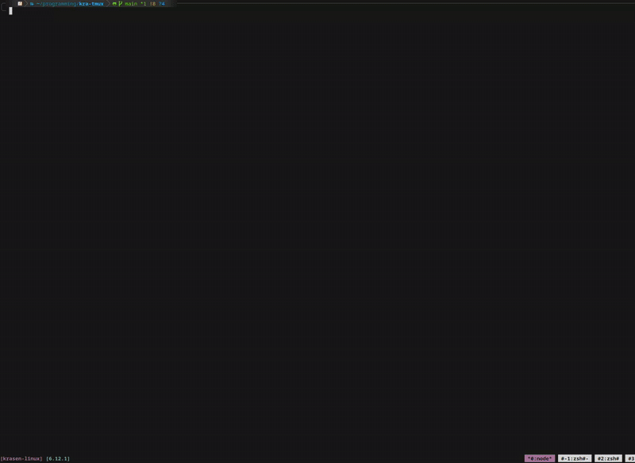
</details>

<details>
<summary>🧹 <strong>kra git hard-reset</strong> - Intelligent branch synchronization</summary>

Comprehensive sync with detailed console output showing pruned branches, fetched updates, and current HEAD state.


</details>

<details>
<summary>📜 <strong>kra git log</strong> - Enhanced commit navigation</summary>

Rich Git log interface in Neovim with optimized formatting and keyboard navigation shortcuts. Press `c` on the highlighted commit to open the interactive cherry-pick menu (apply / --edit / -x / --no-commit / preview commit / preview files / cancel); on conflicts you drop into an in-place resolver that lists conflicted files with status indicators, opens each file in `nvim -c Gvdiffsplit!`, and offers continue / skip / abort actions. `A` aborts an in-progress cherry-pick from the dashboard, and `B` scopes the view to a specific branch (or back to all).

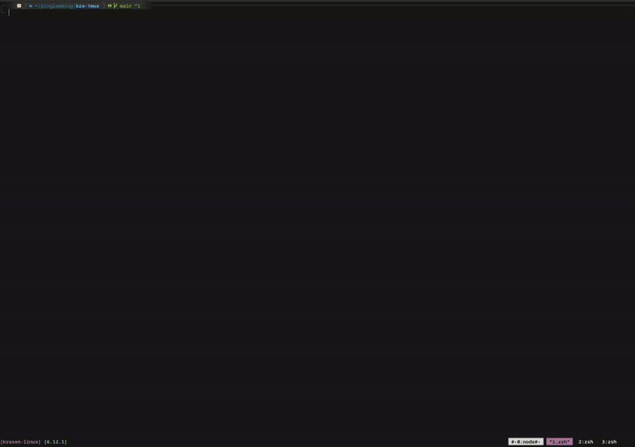
</details>

<details>
<summary>💼 <strong>kra git stash</strong> - Intelligent stash management</summary>

Searchable stash interface with apply/drop actions and detailed stash information.

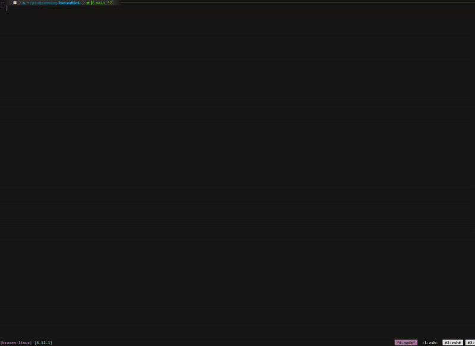
</details>

<details>
<summary>🗑️ <strong>kra git stash-drop-multiple</strong> - Batch stash cleanup</summary>

Efficient multi-stash deletion with live list updates and confirmation prompts.

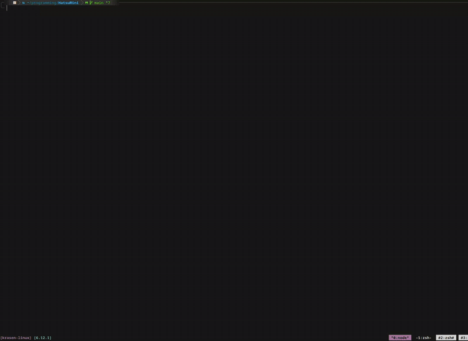
</details>

<details>
<summary>⚔️ <strong>kra git conflict-handle</strong> - Automated conflict resolution</summary>

Three-way merge conflict resolution with automatic marker detection and progress tracking.


</details>

<details>
<summary>🔗 <strong>kra git open-pr</strong> - Cross-platform PR integration</summary>

Automatic pull request detection with GitHub/Bitbucket support and cross-platform browser launching.

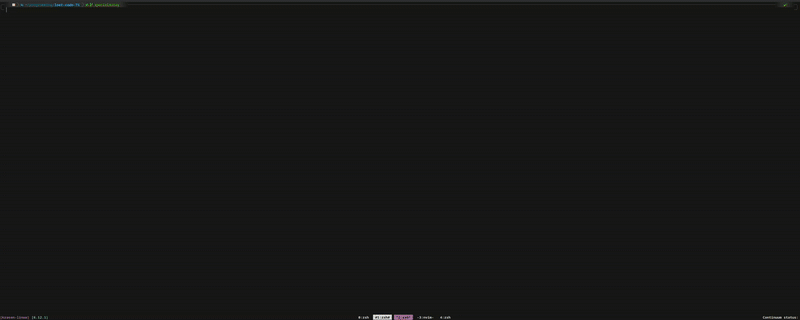
</details>

<details>
<summary>🔍 <strong>kra git view-changed</strong> - Interactive diff viewer</summary>

Two-way diff interface with automatic file list management and smart navigation.


</details>

<details>
<summary>🌿 <strong>kra git create-branch</strong> - Clean branch creation</summary>

Comprehensive branch creation workflow with base branch selection, sync verification, and clean state guarantee.


</details>

<details>
<summary>⏳ <strong>kra git checkout</strong> - Smart branch switching</summary>

Date-filtered branch selection with automatic stash handling, conflict detection. Branches can be filtered by commit titles.


</details>

<details>
<summary>🧭 <strong>kra git reflog</strong> - Recover lost work from HEAD movements</summary>

Reuses the multi-pane log dashboard against `git reflog`, so each entry (checkout / reset / rebase / commit) shows its full commit context, stat summary, and changed files in side panels. Useful for finding commits orphaned by a reset, rebase, or accidental branch delete. Inherits the dashboard keymaps, including the interactive cherry-pick menu on `c` (with the in-place conflict resolver), `A` to abort an in-progress cherry-pick, and `B` to scope the reflog to a specific branch.
</details>

<details>
<summary>🔭 <strong>kra git scout</strong> - Multi-repo workspace overview</summary>

Scans the workspace for every git repository (up to 2 levels deep) and shows them in a full multi-pane dashboard. Dirty repos bubble to the top. Three always-visible right-side panels — **repo details** (branch, modified/untracked counts, ahead/behind, stash count), **recent log** (last 20 commits), and **git status** — all load automatically as you navigate.

Keybindings: `enter` open Neovim, `l` open `kra git log` for that repo (pauses scout, restores it on quit), `d` file-by-file diff picker (opens each changed file in a fugitive split), `f` fetch, `p` pull, `D`/`S-d` toggle dirty-only filter, `r` rescan, `y` copy path, `s`/`/` search by name · path · branch, `Tab` cycle panels, `q` quit.
</details>

---

## 🛠️ System Utilities

**Developer productivity tools** and system management utilities for **efficient project maintenance** and **automated cleanup operations**.

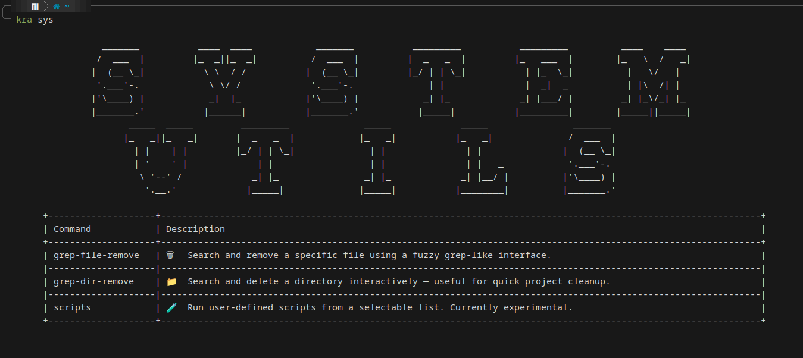

> 📦 **Access via:**
```bash
kra sys
```

### 🛠️ **Available Commands**
| Command            | Description                                                                           |
| ------------------ | ------------------------------------------------------------------------------------- |
| **grep** 🔍             | **Unified search dashboard** — find files/dirs by name or grep content, preview, open in Neovim, batch-delete.     |
| **scripts** 🧪          | **Custom script execution** system (experimental) - Run user-defined automation scripts.                                |
| **process-manager** 📊  | **Live ps dashboard** - search, sort by CPU/MEM/PID, view per-process details, send SIGTERM/SIGKILL.                    |
| **disk-usage** 💾        | **du-style explorer** — scan sizes, expand directories inline, batch-delete, sort by size/name/mtime, open in finder.   |

*Note: Script management system is in active development. Currently requires manual script addition.*

### **Demo Previews** - *Click to expand*
<details>
<summary>🔍 <strong>kra sys grep</strong> - Unified search dashboard</summary>

Three search modes: `f` (files by name), `d` (directories by name), `c` (content grep inside files). Results appear in a navigable list with instant preview and metadata panels.

Keybindings: `f`/`d`/`c` switch mode · `enter` search (in search box) or open in Neovim (on a result) · `x` delete with confirmation · `space` toggle batch-select · `X` delete all selected · `y` copy path · `s`/`/` focus search · `Tab` cycle panels · `q` quit.
</details>

<details>
<summary>🧪 <strong>kra sys scripts</strong> - Custom automation execution</summary>


</details>

<details>
<summary>📊 <strong>kra sys process-manager</strong> - Live process dashboard</summary>

Interactive `ps` browser with search, sort modes (CPU / MEM / PID), windowed list rendering, per-process details and signal sending (SIGTERM / SIGKILL).
</details>

<details>
<summary>💾 <strong>kra sys disk-usage</strong> - du-style disk usage explorer</summary>

Scan the current directory tree and rank entries by size. Expand directories inline (`e` / `l`), batch-select with `space` and bulk-delete with `X`. Switch sort modes (`s`) between size/name/mtime/count. Change root with `R`, jump home with `H`, open in finder with `o`. Live filter via `/`.

Keybindings: `j`/`k` nav · `enter` descend · `-` up · `e`/`l` expand · `space` select · `X` delete selected · `o` open · `s` sort · `/` filter · `r` refresh · `R` new root · `H` home · `y` yank path · `Tab` cycle panels · `q` quit.
</details>

---

## 🚀 Getting Started

### 📋 **Prerequisites**
- **Node.js** (v16+ recommended)
- **Tmux** (v3.0+)
- **Neovim** (v0.8+)
- **Git** (v2.0+)
- **Zsh/Bash** shell environment

### ⚡ **Quick Installation**

Install the published package globally:

```bash
npm install -g kra-workflow

# postinstall auto-creates ~/.kra/, copies a default settings.toml,
# and patches your ~/.bashrc / ~/.zshrc / nvim init.lua.

# Restart your shell (or `source ~/.bashrc`) to pick up the autocompletion
# and tmux/neovim hooks, then run `kra`.
kra
```

Or install from a clone:

```bash
git clone https://github.com/ChrisRistoff/kra-tmux.git
cd kra-tmux
npm install
npm run build
npm install -g .
kra
```

User data lives under `~/.kra/` by default. Override with `KRA_HOME=/path/to/dir`.
If you previously had the project at `~/programming/kra-tmux/`, the first install
will copy `settings.toml`, `git-files/`, `tmux-files/`, `ai-files/`,
`system-files/`, and `lock-files/` from there into `~/.kra/` (originals are
left in place).

### 📚 **Detailed Setup**
For comprehensive installation instructions, environment configuration, and troubleshooting guides, please refer to our **[Installation Guide](INSTALLATION.md)**.

---

## 🎯 **Why Kra Workflow?**

### **🚀 For Individual Developers**
- **Zero work loss** from crashes or unexpected reboots
- **Instant environment restoration** with complete state preservation
- **AI-powered development assistance** with intelligent context awareness
- **Streamlined Git workflows** with advanced conflict resolution

### **🏢 For Development Teams**
- **Consistent development environments** across team members
- **Seamless workspace handoff** and collaboration
- **Enterprise-grade reliability** with production-ready error handling
- **Advanced automation** reducing manual overhead and context switching

### **⚡ Technical Excellence**
- **Advanced Node.js process coordination** with Unix domain sockets
- **Deep Unix system programming integration** for maximum performance
- **Production-ready architecture** with comprehensive error handling
- **Modern terminal UI/UX** with intelligent search and navigation

---

## 📄 **License**

This project is licensed under the MIT License - see the [LICENSE](LICENSE) file for details.

---

<div align="center">

**🚀 Supercharge your development workflow with Kra**

*Built with ❤️ for developers who demand excellence*

[](https://github.com/ChrisRistoff/kra-tmux)

</div>
