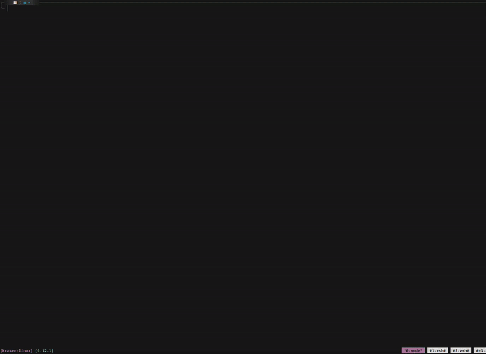
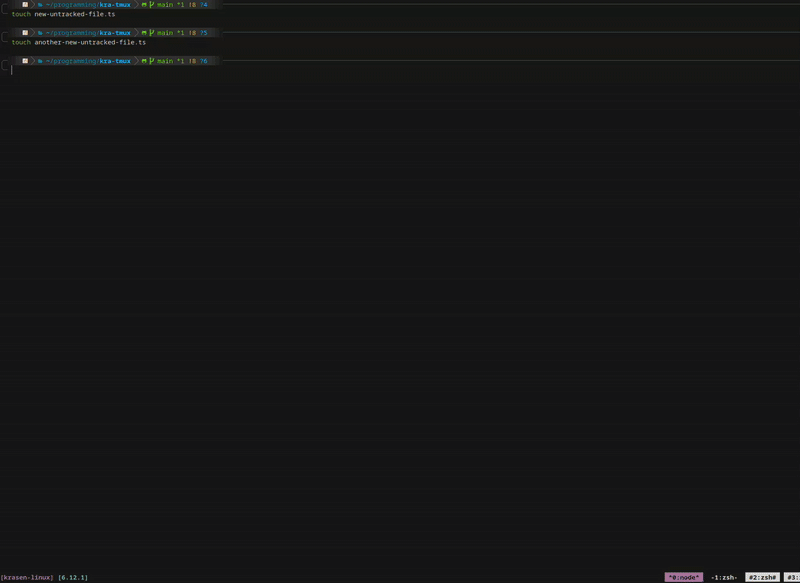
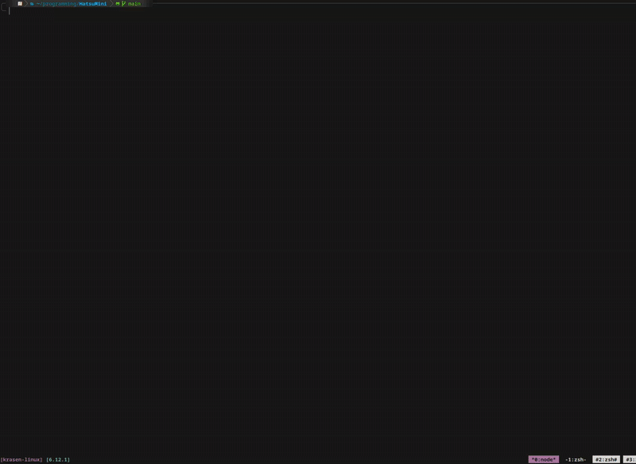
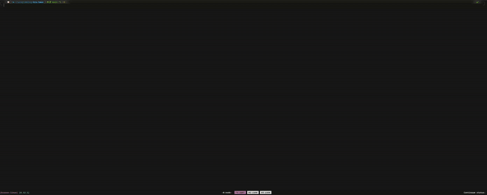
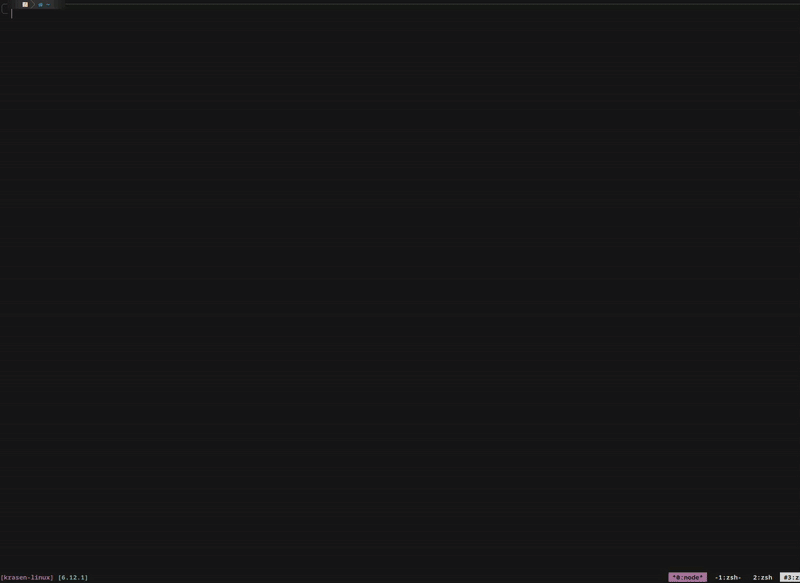
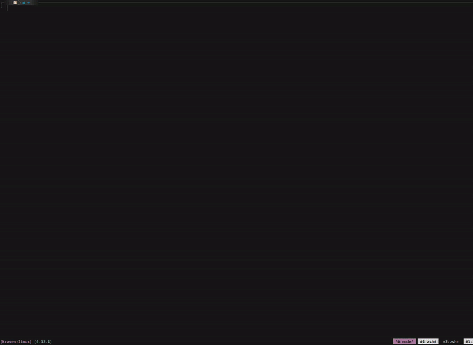

# Kra Workflow

Welcome to **Kra Workflow** — a powerful suite of integrations designed to supercharge your development workflow. With **seamless terminal integrations**, including Tmux server management, Git operations, and an AI chatbot interface, Kra streamlines your workflow with ease.

- All menus and interactive lists are **grep-searchable** for fast access to any functionality.
- Enjoy full **tab autocompletion** in the terminal, ensuring an efficient and intuitive experience when interacting with the tool.

With Kra, you can effortlessly switch between projects, manage Git tasks, and chat with an AI right from your terminal. This comprehensive tool is designed to help you work smarter and more efficiently.


---

## 📚 Contents

- [Tmux Integration](#tmux-integration)
- [Git Integration](#git-integration)
- [AI Chatbot Integration](#ai-chatbot-integration)
- [System Utilities](#system-utilities)
- [Getting Started](#getting-started)

---

## Tmux Integration

My tmux integration module is engineered to give you full control over your server sessions.


> 📦 Access via:
```
kra tmux
```

### 🛠️ Available Commands
| Command            | Description                                                                                                                                        |
| ------------------ | -------------------------------------------------------------------------------------------------------------------------------------------------- |
| **save-server**    | 💾 Save entire servers — including all sessions, windows, panes, and Neovim states. Perfect for multitasking across different projects or tickets. |
| **load-server**    | ♻️ Reload your saved server *exactly* how you left it — including repos (auto-clones if missing), directories, layouts, and editor states.         |
| **delete-session** | 🧹 Clean up specific saved servers. Preview the structure (sessions, windows, names) before confirming deletion.                                   |
| **list-sessions**  | 📋 View a summary of the current server's sessions and windows.                                                                                    |
| **kill**           | ❌ Terminate the currently running server instantly.                                                                                                |

### Commands short demos below, click to expand.
<details>
<summary>💾 kra tmux save-server </summary>

Saves the current tmux server, including all sessions, windows (with their names), panes (with sizes and positions), and active Neovim sessions.


</details>

<details>
<summary>♻️ kra tmux load-server </summary>

Select a saved tmux server from a list to load. If a window name, watch setting, or command is configured, it will automatically run the associated build/watch command in that window.


</details>

<details>
<summary>🧹 kra tmux delete-sessions </summary>

Deletes a saved server. Displays its sessions along with the number of windows and panes, then asks for confirmation before deletion.


</details>

---

## Git Integration

The Git integration in this tool is designed to facilitate efficient source control management.


> 📦 Access via:
```
kra git
```

### 🛠️ Available Commands
| Command                 | Description                                                                                                                  |
| ----------------------- | ---------------------------------------------------------------------------------------------------------------------------- |
| **restore**             | ♻️ Recover single or multiple files effortlessly.                                                                            |
| **cache-untracked**     | 📦 Save untracked files in a branch-specific cache. Files are stored per branch and retrievable only within the same branch. |
| **retrieve-untracked**  | 🔄 Retrieve your previously cached untracked files.                                                                          |
| **hard-reset**          | 🧹 Perform a `git fetch --prune` and hard reset to keep your local branch clean and in sync.                                 |
| **log**                 | 📜 View a rich, navigable Git log inside Neovim. Use `{` and `}` keys to jump between commits.                               |
| **stash**               | 💼 Apply or drop stashes using an intuitive selection interface.                                                             |
| **stash-drop-multiple** | 🗑️ Select and drop multiple stashes in one go from a dynamic list.                                                           |
| **conflict-handle**     | ⚔️ Easily resolve merge conflicts in Neovim with a three-way split and auto-scan until all are resolved.                     |
| **open-pr**            | 🔗 Instantly open the associated pull request link in your browser.                                                          |
| **view-changed**        | 🔍 Instantly see file changes and open them for inspection.                                                                  |


All interactive lists are grep searchable and change depending on input.

### Commands short demos below, click to expand.
<details>
<summary>♻️  kra git restore</summary>

Displays a list of modified files, select the one you want to restore or "all" to restore all of them.


</details>

<details>
<summary>📦 kra git cache-untraccked</summary>

Displays a list of untracked files. Select the ones you want to cache. Files are stored in a branch-specific folder and can only be restored within a branch of the same name.


</details>

<details>
<summary>🔄 kra git retrieve-untracked</summary>

Displays a list of cached untracked files. Select the ones you want to retrieve.


</details>

<details>
<summary>🧹 kra git hard-reset</summary>

Runs git fetch --prune and resets the current branch to its head. Displays a console table showing all pruned and fetched branches, and the current HEAD.


</details>

<details>
<summary>📜 kra git log</summary>

Opens the Git log in Neovim with a readable, navigable format, optimized for jumping through commits.


</details>

<details>
<summary>💼 kra git stash</summary>

Displays a list of stashes. Select one to apply or drop.


</details>

<details>
<summary>🗑️ kra git stash-drop-multiple</summary>

Displays a list of stashes. Select one to drop, the list updates after each drop. Repeat until you choose "done".


</details>

<details>
<summary>⚔️ kra git conflict-handle</summary>

Displays a list of files with merge conflicts. Select a file to open a 3-way diff in Neovim. Once conflict markers are resolved, the file is removed from the list. If markers remain, it stays in the list.


</details>

<details>
<summary>🔍 kra git open-pr</summary>

Opens the pull request associated with the current branch in your default browser. Works with github and bitbucket, works on Mac and Linux.


</details>

<details>
<summary>🔍 kra git view-changed</summary>

Displays a list of modified files. Select one to open a 2-way diff in Neovim. Once closed, the file is removed from the list and the updated list is shown.


</details>

---

## AI Chatbot Integration

User can chat with any model, chat is opened up in neovim, pressing enter in normal mode will send the entire chat as prompt, user and AI messages are formatted in markdown.
**Save** your chats along with a summary. summary will be generated for them and opened in neovim where they can edit it if they so choose. Once the summary is closed the save will be created.


> 📦 Access via:
```
kra ai
```

### 🛠️ Available Commands
| Command    | Description                                                                                                                                                                                                                       |
| ---------- | --------------------------------------------------------------------------------------------------------------------------------------------------------------------------------------------------------------------------------- |
| **chat**   | 🗨️ Start a new chat session in Neovim. Uses socket-based input — send prompts by pressing `Enter` in normal mode. On closing, you're prompted to save the chat. If saved, a summary is generated and editable before final save. |
| **load**   | 📂 Browse saved chats. View the summary first, then decide whether to open the full chat or return to the chat list.                                                                                                              |
| **delete** | 🧽 Select and delete any saved chat from a presented list.                                                                                                                                                                        |

### Commands short demos below, click to expand.
<details>
<summary>🗨️ kra ai chat</summary>

Starts a new AI chat. You'll be prompted to select:

    1. Role – Choose from preconfigured roles or add your own in roles.ts.
    2. Provider – Select from configured providers or define new ones in models.ts.
    3. Temperature – Set a value between 0–10 (divided by 10 internally) or 0–20 when using Gemini.

Once configured, the chat opens in Neovim. You can edit your first message freely. Pressing ENTER in normal mode sends the full chat as a prompt. This setup allows precise control, including removing context or editing hallucinated responses before sending or saving.


</details>

<details>
<summary>💾 save chat feature</summary>

After closing a chat, you'll be prompted to save it (Y/N). If confirmed, Gemini (for its larger context window) is used to generate a summary of the chat. The summary opens in Neovim for editing before being saved.


</details>

<details>
<summary>📂 kra ai load-chat</summary>

Displays a list of saved chats. After selecting one, its summary opens in Neovim. Once reviewed, you can choose whether to load the full chat.


</details>

<details>
<summary>🧽 kra ai delete</summary>

Displays a list of saved chats. Select one to permanently delete.


</details>

---

## System Utilities

The system utilities module provides basic project cleanup tools and is still in early development.


> 📦 Access via:
```
kra sys
```

### 🛠️ Available Commands
| Command            | Description                                                                           |
| ------------------ | -----------------------------------------------------                                 |
| **grep-file-remove** | 🗑️ Search and delete individual files quickly.                                     |
| **grep-dir-remove**  | 📁 Locate and remove directories with ease.                                        |
| **scripts**          | 🧪 Run user scripts (experimental and in progress).                                |
|                      | Currently there is no way to save the scripts, user will have to add them manually. |

### Commands short demos below, click to expand.
<details>
<summary>🗑️ kra sys grep-file-remove</summary>


</details>

<details>
<summary>📁 kra sys grep-dir-remove</summary>


</details>

<details>
<summary>📂 kra sys scripts</summary>


</details>

---

## Getting Started

To get started, please refer to the [Installation Guide](installation.md) which covers the prerequisites, setup instructions, and initial configuration. Once you're set up, dive into each integration module with the links provided above.
